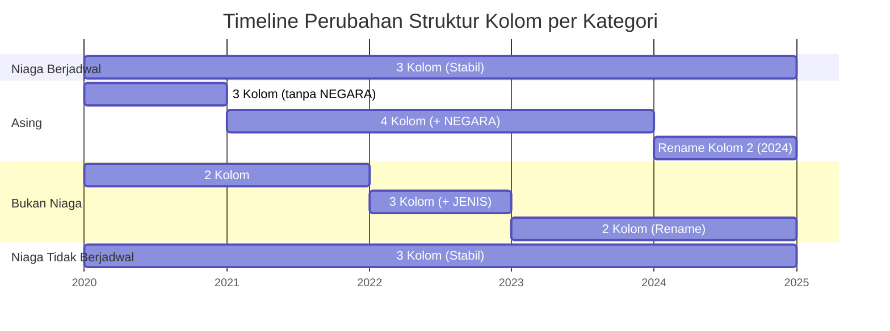
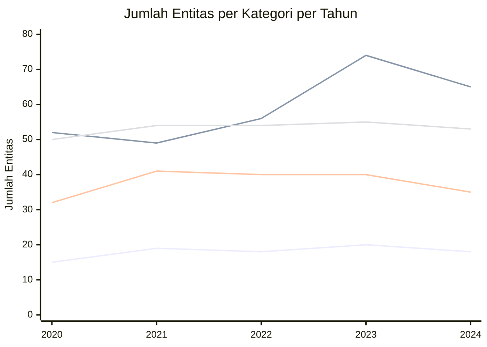
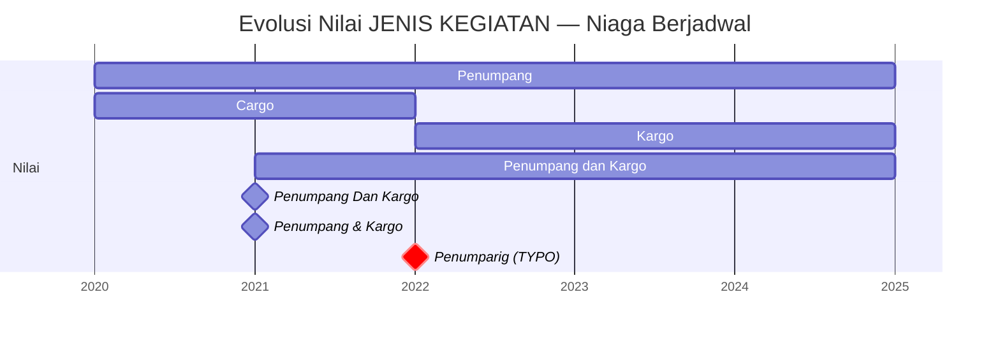
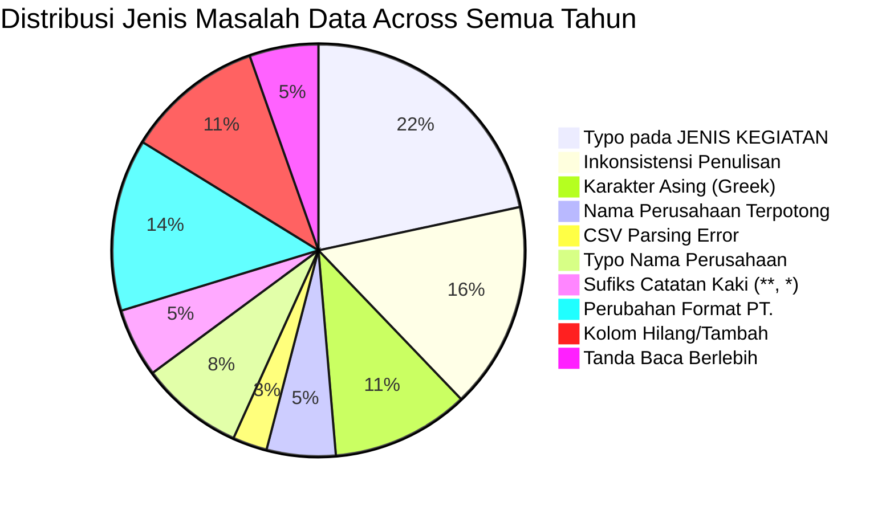
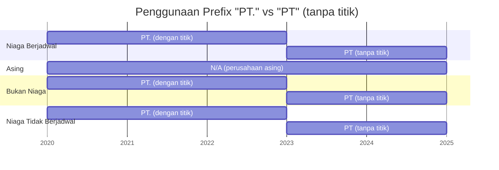

# Analisis Perbandingan Struktur CSV — Perusahaan Angkutan Udara (2020-2024)

## Ringkasan Eksekusi

Dokumen ini membandingkan struktur dan kualitas data dari 4 kategori file CSV selama 5 tahun (2020-2024). Total file yang dianalisis: **20 file CSV** → **20 file analisis individual** → **1 dokumen perbandingan ini**.

---

## 1. Perbandingan Nama File

| Kategori | 2020 | 2021 | 2022 | 2023 | 2024 |
|----------|------|------|------|------|------|
| **Niaga Berjadwal** | `...NIAGA BERJADWAL YANG BEROPERASI TAHUN 2020` | `...NIAGA BERJADWAL TAHUN 2021` | `...NIAGA BERJADWAL TAHUN 2022` | `...NIAGA BERJADWAL TAHUN 2023` | `...NIAGA BERJADWAL TAHUN 2024` |
| **Asing** | `...PERUSAHAAN ANGKUTAN UDARA ASING YANG BEROPERASI TAHUN 2020` | `...PERUSAHAAN ANGKUTAN UDARA ASING TAHUN 2021` | `...PERUSAHAAN ANGKUTAN UDARA ASING TAHUN 2022` | `...PERUSAHAAN ANGKUTAN UDARA ASING TAHUN 2023` | `...PERWAKILAN PERUSAHAAN ANGKUTAN UDARA ASING TAHUN 2024` ⚠️ |
| **Bukan Niaga** | `...PERUSAHAAN ANGKUTAN UDARA BUKAN NIAGA YANG BEROPERASI TAHUN 2020` | `...PERUSAHAAN ANGKUTAN UDARA BUKAN NIAGA TAHUN 2021` | `...PERUSAHAAN ANGKUTAN UDARA BUKAN NIAGA TAHUN 2022` | `...PEMEGANG PERIZINAN ANGKUTAN UDARA BUKAN NIAGA TAHUN 2023` ⚠️ | `...PEMEGANG PERIZINAN ANGKUTAN UDARA BUKAN NIAGA TAHUN 2024` |
| **Niaga Tidak Berjadwal** | `...PERUSAHAAN ANGKUTAN UDARA NIAGA TIDAK BERJADWAL YANG BEROPERASI TAHUN 2020` | `...PERUSAHAAN ANGKUTAN UDARA NIAGA TIDAK BERJADWAL TAHUN 2021` | `...PERUSAHAAN ANGKUTAN UDARA NIAGA TIDAK BERJADWAL TAHUN 2022` | `...BADAN USAHA ANGKUTAN UDARA NIAGA TIDAK BERJADWAL TAHUN 2023` ⚠️ | `...BADAN USAHA ANGKUTAN UDARA NIAGA TIDAK BERJADWAL TAHUN 2024` |

> ⚠️ **Perubahan signifikan:**
> - **2021:** Semua file menghilangkan frasa `"YANG BEROPERASI"`
> - **2023:** Bukan Niaga berubah dari `"DAFTAR PERUSAHAAN"` → `"DAFTAR PEMEGANG PERIZINAN"`
> - **2023:** Niaga Tidak Berjadwal berubah dari `"DAFTAR PERUSAHAAN"` → `"DAFTAR BADAN USAHA"`
> - **2024:** Asing berubah dari `"DAFTAR PERUSAHAAN"` → `"DAFTAR PERWAKILAN PERUSAHAAN"`

---

## 2. Perbandingan Struktur Kolom

### 2.1 Niaga Berjadwal — Stabil ✅

| Tahun | Kolom 1 | Kolom 2 | Kolom 3 | Jumlah |
|-------|---------|---------|---------|--------|
| 2020 | `NO` | `NAMA BADAN USAHA` | `JENIS KEGIATAN` | 3 |
| 2021 | `NO` | `NAMA BADAN USAHA` | `JENIS KEGIATAN` | 3 |
| 2022 | `NO` | `NAMA BADAN USAHA` | `JENIS KEGIATAN` | 3 |
| 2023 | `NO` | `NAMA BADAN USAHA` | `JENIS KEGIATAN` | 3 |
| 2024 | `NO` | `NAMA BADAN USAHA` | `JENIS KEGIATAN` | 3 |

**Status:** ✅ **Konsisten** sepanjang 5 tahun

---

### 2.2 Asing — Ada Perubahan ⚠️

| Tahun | Kolom 1 | Kolom 2 | Kolom 3 | Kolom 4 | Jumlah |
|-------|---------|---------|---------|---------|--------|
| 2020 | `NO` | `NAMA PERUSAHAAN` | `JENIS KEGIATAN` | — | **3** |
| 2021 | `NO` | `NAMA PERUSAHAAN` | `NEGARA` | `JENIS KEGIATAN` | **4** |
| 2022 | `NO` | `NAMA PERUSAHAAN` | `NEGARA` | `JENIS KEGIATAN` | **4** |
| 2023 | `NO` | `NAMA PERUSAHAAN` | `NEGARA` | `JENIS KEGIATAN` | **4** |
| 2024 | `NO` | `NAMA ANGKUTAN UDARA ASING` ⚠️ | `NEGARA` | `JENIS KEGIATAN` | **4** |

> ⚠️ **Perubahan:**
> - **2020 → 2021:** Kolom `NEGARA` ditambahkan (3 → 4 kolom)
> - **2024:** Kolom `NAMA PERUSAHAAN` → `NAMA ANGKUTAN UDARA ASING`

---

### 2.3 Bukan Niaga — Perubahan Drastis 🚨

| Tahun | Kolom 1 | Kolom 2 | Kolom 3 | Jumlah |
|-------|---------|---------|---------|--------|
| 2020 | `NO` | `NAMA BADAN USAHA` | — | **2** |
| 2021 | `NO` | `NAMA BADAN USAHA` | — | **2** |
| 2022 | `NO` | `NAMA BADAN USAHA` | `JENIS KEGIATAN` | **3** ⚠️ |
| 2023 | `NO` | `NAMA PERUSAHAAN` ⚠️ | — | **2** |
| 2024 | `NO` | `NAMA PERUSAHAAN` | — | **2** |

> 🚨 **Perubahan:**
> - **2022:** Kolom `JENIS KEGIATAN` **ditambahkan** (2 → 3 kolom)
> - **2023:** Kolom `JENIS KEGIATAN` **dihapus** (3 → 2 kolom) — kembali ke format lama
> - **2023:** Kolom `NAMA BADAN USAHA` → `NAMA PERUSAHAAN`

---

### 2.4 Niaga Tidak Berjadwal — Stabil ✅

| Tahun | Kolom 1 | Kolom 2 | Kolom 3 | Jumlah |
|-------|---------|---------|---------|--------|
| 2020 | `NO` | `NAMA BADAN USAHA` | `JENIS KEGIATAN` | 3 |
| 2021 | `NO` | `NAMA BADAN USAHA` | `JENIS KEGIATAN` | 3 |
| 2022 | `NO` | `NAMA BADAN USAHA` | `JENIS KEGIATAN` | 3 |
| 2023 | `NO` | `NAMA BADAN USAHA` | `JENIS KEGIATAN` | 3 |
| 2024 | `NO` | `NAMA BADAN USAHA` | `JENIS KEGIATAN` | 3 |

**Status:** ✅ **Konsisten** sepanjang 5 tahun

---

## 3. Diagram Timeline Perubahan Struktur

---

## 4. Perbandingan Jumlah Baris Data

### Tabel Jumlah Baris

| Kategori | 2020 | 2021 | 2022 | 2023 | 2024 | Trend |
|----------|------|------|------|------|------|-------|
| **Niaga Berjadwal** | 15 | 19 | 18 | 20 | 18 | ↔️ Stabil (~18) |
| **Asing** | 52 | 49 | 56 | 74 | 65 | 📈 Fluktuatif (naik di 2023, turun di 2024) |
| **Bukan Niaga** | 32 | 41 | 40 | 40 | 35 | 📉 Cenderung turun |
| **Niaga Tidak Berjadwal** | 50 | 54 | 54 | 55 | 53 | ↔️ Stabil (~53) |

> 📊 **Insight:**
> - Kategori **Asing** paling fluktuatif — lonjakan di 2023 (+18 entitas) kemungkinan karena pembukaan kembali rute internasional pasca pandemi
> - Kategori **Bukan Niaga** cenderung menurun — mungkin ada penertiban lisensi

---

## 5. Perbandingan Tipe Data & Nilai `JENIS KEGIATAN`

### 5.1 Niaga Berjadwal — Evolusi Nilai

| Tahun | Nilai Unik | Catatan |
|-------|------------|---------|
| 2020 | `Penumpang`, `Cargo` | Hanya 2 nilai, konsisten |
| 2021 | `Penumpang`, `Cargo`, `Penumpang dan Kargo`, `Penumpang Dan Kargo`, `Penumpang & Kargo` | 🚨 **5 variasi** — inkonsisten |
| 2022 | `Penumpang`, `Kargo`, `Penumpang dan Kargo`, `Penumparig` **(TYPO)** | "Cargo" → "Kargo"; ada typo |
| 2023 | `Penumpang`, `Kargo`, `Penumpang dan Kargo` | ✅ Bersih, konsisten |
| 2024 | `Penumpang`, `Kargo`, `Penumpang dan Kargo` | ✅ Bersih, konsisten |

---

### 5.2 Asing — Evolusi Nilai

| Tahun | Nilai Unik | Catatan |
|-------|------------|---------|
| 2020 | `Penumpang`, `Cargo`, `Penumpang & Cargo` | 3 nilai, konsisten |
| 2021 | `Penumpang`, `Cargo`, `Penumpang & Cargo` | 3 nilai, konsisten |
| 2022 | `Penumpang`, `Kargo`, `Penumpang dan Kargo`, `Perumpang` **(TYPO)**, `Penumpang.` **(titik)** | 🚨 5 variasi + typo |
| 2023 | `Penumpang dan Kargo`, `Khusus Kargo` | ✅ Diseragamkan |
| 2024 | `Penumpang dan Kargo`, `Khusus Kargo` | ✅ Bersih, konsisten |

> 📊 **Insight:** 2023-2024 semua perusahaan Asing yang sebelumnya terpisah jadi `"Penumpang"`, `"Cargo"`, `"Penumpang & Cargo"` sekarang digabung jadi `"Penumpang dan Kargo"` — kebijakan klasifikasi berubah

---

### 5.3 Bukan Niaga — Evolusi Nilai

| Tahun | Nilai Unik | Catatan |
|-------|------------|---------|
| 2020 | *(tidak ada kolom)* | — |
| 2021 | *(tidak ada kolom)* | — |
| 2022 | `Flying School`, `Fiving School` **(TYPO)**, `Flving School` **(TYPO)**, `Kegiatan Olahraga`, `Kegiatan Kemanusiaan`, `Penyemprotan perkebunan`, `Penyemprotan Pertanian`, `Mobilitas perusahaan`, `Perakitan Pesawat/Pabrikan`, `Patroli Udara`, `Perakiran Cuaca`, `Mengkalibrasi Pesawat`, `Membawa Alat untuk Foto Udara`, `Penumpang dan Angkutan Lainnya`, `(Data Kosong)` | 🚨 **15 nilai** — banyak typo |
| 2023 | *(tidak ada kolom)* | — |
| 2024 | *(tidak ada kolom)* | — |

> 📊 **Insight:** Kolom `JENIS KEGIATAN` di 2022 sangat detail tapi **kotor** — 6 dari 40 baris punya typo. Tahun lain tidak punya kolom ini.

---

### 5.4 Niaga Tidak Berjadwal — Evolusi Nilai

| Tahun | Nilai Unik | Catatan |
|-------|------------|---------|
| 2020 | `Penumpang`, `Cargo`, `Penumpang & Cargo` | 3 nilai, konsisten |
| 2021 | `Penumpang`, `Cargo`, `Penumpang & Cargo`, `Penumpang dan kargo` | 4 nilai — inkonsisten |
| 2022 | `Penumpang`, `Kargo`, `Penumpang dan Kargo`, `Penumparig` **(TYPO)** | 4 nilai — ada typo |
| 2023 | 11+ variasi detail | 🚨 Sangat bervariasi: "dalam negeri", "luar negeri", "khusus kargo", dll |
| 2024 | 10+ variasi detail | Masih bervariasi tapi sedikit lebih rapi |

> 📊 **Insight:** 2023-2024 nilai `JENIS KEGIATAN` menjadi sangat detail dan sulit di-standardize. Perlu normalisasi untuk analisis.

---

## 6. Diagram Distribusi Masalah Kualitas Data

---

## 7. Daftar Lengkap Typo & Anomali per Tahun

### 7.1 Typo pada `JENIS KEGIATAN`

| Tahun | File | Nilai Salah | Seharusnya | Baris |
|-------|------|-------------|------------|-------|
| 2022 | Niaga Berjadwal | `Penumparig` | `Penumpang` | 1 |
| 2022 | Niaga Tidak Berjadwal | `Penumparig` | `Penumpang` | 1 |
| 2022 | Asing | `Perumpang` | `Penumpang` | 2 |
| 2022 | Bukan Niaga | `Fiving School` | `Flying School` | 5 |
| 2022 | Bukan Niaga | `Flving School` | `Flying School` | 1 |
| 2021 | Niaga Berjadwal | `Penumpang Dan Kargo` | `Penumpang dan Kargo` | 1 (kapitalisasi) |
| 2021 | Niaga Tidak Berjadwal | `Penumpang dan kargo` | `Penumpang dan Kargo` | 1 (kapitalisasi) |

### 7.2 Typo pada `NAMA BADAN USAHA / NAMA PERUSAHAAN`

| Tahun | File | Nilai Salah | Seharusnya | Keterangan |
|-------|------|-------------|------------|------------|
| 2020-2022 | Asing | `AIR ASIA BERHARD` | `AIR ASIA BERHAD` | Typo persisten 3 tahun |
| 2021-2024 | Asing | `PHILIPINE` | `PHILIPPINE` | Typo nama negara |
| 2021-2024 | Niaga Tidak Berjadwal | `PT Pelita Air Sevice` | `PT Pelita Air Service` | **Typo persisten 4 tahun!** |
| 2022 | Niaga Tidak Berjadwal | `PT. EKSPRES TRANSPORTASI ANTAR BENJA` | `...ANTAR BENUA` | Huruf hilang |
| 2022 | Niaga Berjadwal | `PT LINKAVIASI ASIA INDONESIA` | `PT. LINKAVIASI...` | Tanpa titik |

### 7.3 Karakter Asing (Greek Letters)

| Tahun | File | Nilai | Karakter Greek | Seharusnya |
|-------|------|-------|----------------|------------|
| 2021-2024 | Bukan Niaga | `PT. AVIATERRA DINΑΜΙΚΑ` | `Α`, `Μ`, `Ι`, `Κ`, `Α` | `DINAMIKA` |
| 2023-2024 | Asing | `ΧΙΑΜΕN AIRLINES` | `Χ`, `Ι` | `XIAMEN AIRLINES` |
| 2024 | Asing | `ΟΜΑΝ AIR` | `Ο`, `Μ` | `OMAN AIR` |

### 7.4 Anomali Format

| Tahun | File | Anomali | Keterangan |
|-------|------|---------|------------|
| 2021 | Asing | Sufiks `**` pada 11 perusahaan | Spasi tidak konsisten sebelum `**` |
| 2022 | Asing | `"Penumpang."` dengan titik (3 entitas) | Tanda baca berlebih |
| 2022 | Niaga Tidak Berjadwal | `"PT. INDO STAR AVIATION"""""` | CSV escaping error |
| 2023 | Niaga Tidak Berjadwal | `PT Eastindo Services (East Indonesia Air Taxi An` | Nama terpotong |
| 2024 | Bukan Niaga | `BB-TMC BPPT) - BRIN...` | Kurung buka hilang |

---

## 8. Perubahan Format Prefix "PT."

> 📊 **Insight:** Mulai **2023**, semua file konsisten menggunakan `"PT"` tanpa titik. Ini perubahan standar penulisan — bisa jadi karena kebijakan baru atau perbedaan tim input data.

---

## 9. Mapping Kolom untuk ETL/Integrasi

Jika Anda ingin menggabungkan data dari berbagai tahun, berikut mapping yang diperlukan:

### 9.1 Asing — Mapping Nama Kolom

| Kolom Standard | 2020 | 2021 | 2022 | 2023 | 2024 |
|----------------|------|------|------|------|------|
| `NO` | `NO` | `NO` | `NO` | `NO` | `NO` |
| `NAMA_PERUSAHAAN` | `NAMA PERUSAHAAN` | `NAMA PERUSAHAAN` | `NAMA PERUSAHAAN` | `NAMA PERUSAHAAN` | `NAMA ANGKUTAN UDARA ASING` ⚠️ |
| `NEGARA` | *(tidak ada)* | `NEGARA` | `NEGARA` | `NEGARA` | `NEGARA` |
| `JENIS_KEGIATAN` | `JENIS KEGIATAN` | `JENIS KEGIATAN` | `JENIS KEGIATAN` | `JENIS KEGIATAN` | `JENIS KEGIATAN` |

### 9.2 Bukan Niaga — Mapping Nama Kolom

| Kolom Standard | 2020 | 2021 | 2022 | 2023 | 2024 |
|----------------|------|------|------|------|------|
| `NO` | `NO` | `NO` | `NO` | `NO` | `NO` |
| `NAMA_BADAN_USAHA` | `NAMA BADAN USAHA` | `NAMA BADAN USAHA` | `NAMA BADAN USAHA` | `NAMA PERUSAHAAN` ⚠️ | `NAMA PERUSAHAAN` |
| `JENIS_KEGIATAN` | *(tidak ada)* | *(tidak ada)* | `JENIS KEGIATAN` | *(tidak ada)* | *(tidak ada)* |

---

## 10. Standardisasi Nilai `JENIS KEGIATAN` yang Disarankan

Untuk keperluan analisis, disarankan normalisasi nilai berikut:

| Nilai Asli | Nilai Standard |
|------------|----------------|
| `Penumpang` | `Penumpang` |
| `Penumparig` | `Penumpang` |
| `Perumpang` | `Penumpang` |
| `Cargo` | `Kargo` |
| `Kargo` | `Kargo` |
| `Khusus Kargo` | `Kargo` |
| `Penumpang & Cargo` | `Penumpang dan Kargo` |
| `Penumpang & Kargo` | `Penumpang dan Kargo` |
| `Penumpang Dan Kargo` | `Penumpang dan Kargo` |
| `Penumpang dan kargo` | `Penumpang dan Kargo` |
| `Penumpang dan Kargo dalam negeri` | `Penumpang dan Kargo` |
| `Penumpang dan Kargo dalam dan luar negeri` | `Penumpang dan Kargo` |
| `Penumpang dan Kargo, ...` | `Penumpang dan Kargo` |
| `Penumpang dan Kargo; khusus kargo` | `Penumpang dan Kargo` |
| `Kargo dalam negeri` | `Kargo` |
| `Kargo dalam dan luar negeri` | `Kargo` |
| `Kargo dalam dan luar negeri serta Penumpang dan Kargo` | `Penumpang dan Kargo` |

---

## 11. Kesimpulan

### ✅ Yang Konsisten
1. **Niaga Berjadwal** dan **Niaga Tidak Berjadwal**: Struktur kolom stabil 3 kolom selama 5 tahun
2. **Total entitas** cenderung stabil (kecuali Asing yang fluktuatif)
3. **Tidak ada data kosong/null/NaN** di semua file — pengisian data lengkap

### ⚠️ Yang Perlu Diperbaiki
1. **Typo persisten:** `PT Pelita Air Sevice` (4 tahun berturut-turut!) — butuh koreksi di sumber
2. **Karakter Greek:** `ΧΙΑΜΕN AIRLINES`, `ΟΜΑΝ AIR`, `PT. AVIATERRA DINΑΜΙΚΑ` — encoding issue
3. **Inkonsistensi `JENIS KEGIATAN`** di 2021-2022 — butuh standardisasi
4. **Perubahan nama kolom** di 2024 (Asing) — butuh mapping untuk ETL

### 🚨 Breaking Changes
1. **Bukan Niaga 2022:** Tambah kolom `JENIS KEGIATAN`, lalu hilang di 2023
2. **Asing 2021:** Tambah kolom `NEGARA`
3. **Asing 2024:** Rename kolom `NAMA PERUSAHAAN` → `NAMA ANGKUTAN UDARA ASING`
4. **Bukan Niaga 2023:** Rename kolom `NAMA BADAN USAHA` → `NAMA PERUSAHAAN`
5. **Semua kategori 2023:** Perubahan format `PT.` → `PT`

### 💡 Rekomendasi
1. **Buat data dictionary** untuk standardisasi nilai `JENIS KEGIATAN`
2. **Fix encoding source** untuk karakter Greek
3. **Typo correction script** untuk `Sevice` → `Service`, `Penumparig` → `Penumpang`, dll
4. **Kolom mapping layer** untuk ETL pipeline
5. **Validasi data otomatis** sebelum publish untuk mencegah typo berulang

---

## 12. Referensi File Analisis Individual

| Tahun | Kategori | File Analisis |
|-------|----------|---------------|
| 2020 | Niaga Berjadwal | `2020/NIAGA_BERJADWAL_2020_analysis.md` |
| 2020 | Asing | `2020/ASING_2020_analysis.md` |
| 2020 | Bukan Niaga | `2020/BUKAN_NIAGA_2020_analysis.md` |
| 2020 | Niaga Tidak Berjadwal | `2020/NIAGA_TIDAK_BERJADWAL_2020_analysis.md` |
| 2021 | Niaga Berjadwal | `2021/NIAGA_BERJADWAL_2021_analysis.md` |
| 2021 | Asing | `2021/ASING_2021_analysis.md` |
| 2021 | Bukan Niaga | `2021/BUKAN_NIAGA_2021_analysis.md` |
| 2021 | Niaga Tidak Berjadwal | `2021/NIAGA_TIDAK_BERJADWAL_2021_analysis.md` |
| 2022 | Niaga Berjadwal | `2022/NIAGA_BERJADWAL_2022_analysis.md` |
| 2022 | Asing | `2022/ASING_2022_analysis.md` |
| 2022 | Bukan Niaga | `2022/BUKAN_NIAGA_2022_analysis.md` |
| 2022 | Niaga Tidak Berjadwal | `2022/NIAGA_TIDAK_BERJADWAL_2022_analysis.md` |
| 2023 | Niaga Berjadwal | `2023/NIAGA_BERJADWAL_2023_analysis.md` |
| 2023 | Asing | `2023/ASING_2023_analysis.md` |
| 2023 | Bukan Niaga | `2023/BUKAN_NIAGA_2023_analysis.md` |
| 2023 | Niaga Tidak Berjadwal | `2023/NIAGA_TIDAK_BERJADWAL_2023_analysis.md` |
| 2024 | Niaga Berjadwal | `2024/NIAGA_BERJADWAL_2024_analysis.md` |
| 2024 | Asing | `2024/ASING_2024_analysis.md` |
| 2024 | Bukan Niaga | `2024/BUKAN_NIAGA_2024_analysis.md` |
| 2024 | Niaga Tidak Berjadwal | `2024/NIAGA_TIDAK_BERJADWAL_2024_analysis.md` |

---

*Dokumen ini dibuat berdasarkan analisis 20 file CSV dari tahun 2020-2024.*
*Semua temuan diverifikasi dari data asli, bukan asumsi.*
