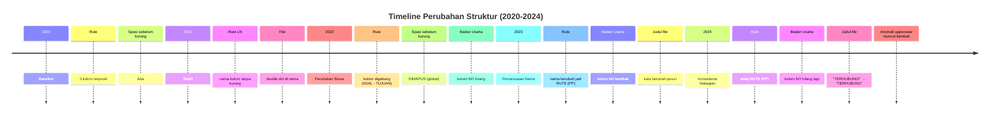

# Analisis Perbandingan Struktur CSV — Rute & Bandara Angkutan Udara (2020–2024)

Dokumen ini membandingkan struktur, format, penamaan, dan kualitas data dari semua file CSV rute & bandara angkutan udara selama 5 tahun (2020–2024).

---

## 1. Perbandingan Judul Tabel

### 1.1 Badan Usaha Nasional — Rute Internasional

| Tahun | Judul File (asli) | Catatan Perubahan |
|-------|-------------------|-------------------|
| 2020 | `...NASIONAL YANG MELAYANI PENUMPANG RUTE INTERNASIONAL...` | — |
| 2021 | `...NASIONAL YANG MELAYANI PENUMPANG RUTE INTERNASIONAL...` | ✅ Konsisten |
| 2022 | `...NASIONAL YANG MELAYANI PENUMPANG RUTE INTERNASIONAL...` | ✅ Konsisten |
| 2023 | `...NASIONAL PENUMPANG YANG MELAYANI RUTE INTERNASIONAL...` | ⚠️ **Kata berubah**: "YANG MELAYANI PENUMPANG" → "PENUMPANG YANG MELAYANI" |
| 2024 | `...NASIONAL PENUMPANG YANG MELAYANI RUTE INTERNASIONAL` | ✅ Konsisten dengan 2023 (tanpa "TAHUN 2024") |

### 1.2 Kota Domestik

| Tahun | Judul File (asli) | Catatan Perubahan |
|-------|-------------------|-------------------|
| 2020 | `KOTA TERHUBUNGI OLEH RUTE ANGKUTAN UDARA NIAGA BERJADWAL DALAM NEGERI...` | — |
| 2021 | `KOTA TERHUBUNGI OLEH RUTE ANGKUTAN UDARA NIAGA BERJADWAL DALAM NEGERI...` | ✅ Konsisten |
| 2022 | `KOTA TERHUBUNGI OLEH RUTE ANGKUTAN UDARA NIAGA BERJADWAL DALAM NEGERI...` | ✅ Konsisten |
| 2023 | `KOTA TERHUBUNGI OLEH RUTE ANGKUTAN UDARA NIAGA BERJADWAL DALAM NEGERI...` | ✅ Konsisten |
| 2024 | `KOTA TERHUBUNG OLEH ANGKUTAN UDARA NIAGA BERJADWAL DALAM NEGERI...` | ⚠️ **Berubah**: "TERHUBUNGI OLEH RUTE" → "TERHUBUNG OLEH" (kata "RUTE" hilang) |

### 1.3 Kota LN — Indonesia

| Tahun | Judul File (asli) | Catatan Perubahan |
|-------|-------------------|-------------------|
| 2020 | `KOTA TERHUBUNGI OLEH RUTE ANGKUTAN UDARA NIAGA BERJADWAL LUAR NEGERI DI INDONESIA...` | — |
| 2021 | `KOTA TERHUBUNGI OLEH RUTE ANGKUTAN UDARA NIAGA BERJADWAL LUAR NEGERI DI INDONESIA...` | ✅ Konsisten |
| 2022 | `KOTA TERHUBUNGI OLEH RUTE ANGKUTAN UDARA NIAGA BERJADWAL LUAR NEGERI DI INDONESIA...` | ✅ Konsisten |
| 2023 | `KOTA TERHUBUNGI OLEH RUTE ANGKUTAN UDARA NIAGA BERJADWAL LUAR NEGERI DI INDONESIA...` | ✅ Konsisten |
| 2024 | `KOTA TERHUBUNG OLEH RUTE ANGKUTAN UDARA NIAGA BERJADWAL LUAR NEGERI DI INDONESIA...` | ⚠️ **Berubah**: "TERHUBUNGI" → "TERHUBUNG" |

### 1.4 Kota LN — Negara Tujuan

| Tahun | Judul File (asli) | Catatan Perubahan |
|-------|-------------------|-------------------|
| 2020 | `KOTA TERHUBUNGI OLEH RUTE ANGKUTAN UDARA NIAGA BERJADWAL LUAR NEGERI DI NEGARA TUJUAN...` | — |
| 2021 | `KOTA TERHUBUNGI OLEH RUTE ANGKUTAN UDARA NIAGA BERJADWAL LUAR NEGERI DI NEGARA TUJUAN...` | ✅ Konsisten |
| 2022 | `KOTA TERHUBUNGI OLEH RUTE ANGKUTAN UDARA NIAGA BERJADWAL LUAR NEGERI DI NEGARA TUJUAN...` | ✅ Konsisten |
| 2023 | `KOTA TERHUBUNGI OLEH RUTE ANGKUTAN UDARA NIAGA BERJADWAL LUAR NEGERI DI NEGARA TUJUAN...` | ✅ Konsisten |
| 2024 | `KOTA TERHUBUNG OLEH RUTE ANGKUTAN UDARA NIAGA BERJADWAL LUAR NEGERI DI NEGARA TUJUAN...` | ⚠️ **Berubah**: "TERHUBUNGI" → "TERHUBUNG" |

### 1.5 Rute Domestik

| Tahun | Judul File (asli) | Catatan Perubahan |
|-------|-------------------|-------------------|
| 2020 | `RUTE ANGKUTAN UDARA NIAGA BERJADWAL DALAM NEGERI TAHUN 2020.csv` | — |
| 2021 | `RUTE ANGKUTAN UDARA NIAGA BERJADWAL DALAM NEGERI TAHUN 2021..csv` | ⚠️ **Double dot**: `...TAHUN 2021..csv` |
| 2022 | `RUTE ANGKUTAN UDARA NIAGA BERJADWAL DALAM NEGERI TAHUN 2022.csv` | ✅ Kembali normal |
| 2023 | `RUTE ANGKUTAN UDARA NIAGA BERJADWAL DALAM NEGERI TAHUN 2023.csv` | ✅ Konsisten |
| 2024 | `RUTE ANGKUTAN UDARA NIAGA BERJADWAL DALAM NEGERI TAHUN 2024.csv` | ✅ Konsisten |

### 1.6 Rute Internasional (LN)

| Tahun | Judul File (asli) | Catatan Perubahan |
|-------|-------------------|-------------------|
| 2020 | `RUTE ANGKUTAN UDARA NIAGA BERJADWAL LUAR NEGERI TAHUN 2020.csv` | — |
| 2021 | `RUTE ANGKUTAN UDARA NIAGA BERJADWAL LUAR NEGERI TAHUN 2021.csv` | ✅ Konsisten |
| 2022 | `RUTE ANGKUTAN UDARA NIAGA BERJADWAL LUAR NEGERI TAHUN 2022.csv` | ✅ Konsisten |
| 2023 | `RUTE ANGKUTAN UDARA NIAGA BERJADWAL LUAR NEGERI TAHUN 2023.csv` | ✅ Konsisten |
| 2024 | `RUTE ANGKUTAN UDARA NIAGA BERJADWAL LUAR NEGERI TAHUN 2024.csv` | ✅ Konsisten |

### 1.7 File Agregat (hanya 2024)

| Nama File | Deskripsi |
|-----------|-----------|
| `TOTAL JUMLAH RUTE DOMESTIK ANGKUTAN UDARA NIAGA BERJADWAL TAHUN 2020-2024.csv` | Agregat 5 tahun rute domestik |
| `TOTAL JUMLAH RUTE INTERNATIONAL TAHUN 2020-2024.csv` | Agregat 7 tahun rute internasional (2018–2024) |

---

## 2. Perbandingan Struktur Tabel (Kolom)

### 2.1 Ringkasan Jumlah Kolom per Kategori

| Kategori | 2020 | 2021 | 2022 | 2023 | 2024 | Tren |
|----------|------|------|------|------|------|------|
| **Badan Usaha Nasional** | 2 | 2 | **1** | 2 | **1** | 🔴 Bolak-balik |
| **Kota Domestik** | 2 | 2 | 2 | 2 | 2 | ✅ Stabil |
| **Kota LN — Indonesia** | 2 | 2 | 2 | 2 | 2 | ✅ Stabil |
| **Kota LN — Negara Tujuan** | 2 | 2 | 2 | 2 | 2 | ✅ Stabil |
| **Rute Domestik** | 3 | 3 | **2** | **2** | **2** | 🔴 Berubah |
| **Rute LN** | 3 | **3*** | **2** | **2** | **2** | 🔴 Berubah |

> \* 2021: Nama kolom berubah (`RUTE ASAL` tanpa kurung, vs `RUTE (ASAL)` di 2020)

### 2.2 Detail Perubahan Nama Kolom

#### Badan Usaha Nasional — Rute Internasional

| Tahun | Kolom | Catatan |
|-------|-------|---------|
| 2020 | `NO`, `NAMA BADAN USAHA` | — |
| 2021 | `NO`, `NAMA BADAN USAHA` | ✅ Konsisten |
| 2022 | `NAMA BADAN USAHA` | ⚠️ **Kolom NO hilang** |
| 2023 | `NO`, `NAMA BADAN USAHA` | ⚠️ **Kolom NO kembali** |
| 2024 | `NAMA BADAN USAHA` | ⚠️ **Kolom NO hilang lagi** |

#### Kota Domestik

| Tahun | Kolom | Catatan |
|-------|-------|---------|
| 2020–2024 | `NO`, `KOTA` | ✅ Konsisten di semua tahun |

#### Kota LN — Indonesia

| Tahun | Kolom | Catatan |
|-------|-------|---------|
| 2020–2024 | `NO`, `KOTA` | ✅ Konsisten di semua tahun |

#### Kota LN — Negara Tujuan

| Tahun | Kolom | Catatan |
|-------|-------|---------|
| 2020–2024 | `NO`, `KOTA` | ✅ Konsisten di semua tahun |

#### Rute Domestik

| Tahun | Kolom | Catatan |
|-------|-------|---------|
| 2020 | `NO`, `RUTE (ASAL)`, `RUTE (TUJUAN)` | — |
| 2021 | `NO`, `RUTE (ASAL)`, `RUTE (TUJUAN)` | ✅ Konsisten |
| 2022 | `NO`, `RUTE (ASAL - TUJUAN)` | 🔴 **Kolom digabung**: Asal + Tujuan → 1 kolom |
| 2023 | `NO`, `RUTE (PP)` | 🔴 **Nama berubah**: "PP" (Pulang Pergi) |
| 2024 | `NO`, `RUTE (PP)` | ✅ Konsisten dengan 2023 |

#### Rute LN

| Tahun | Kolom | Catatan |
|-------|-------|---------|
| 2020 | `NO`, `RUTE (ASAL)`, `RUTE (TUJUAN)` | — |
| 2021 | `NO`, `RUTE ASAL`, `RUTE TUJUAN` | ⚠️ **Kurung dihapus**: `(ASAL)` → `ASAL` |
| 2022 | `NO`, `RUTE (ASAL - TUJUAN)` | 🔴 **Kolom digabung**: Asal + Tujuan → 1 kolom |
| 2023 | `NO`, `RUTE (PP)` | 🔴 **Nama berubah**: "PP" (Pulang Pergi) |
| 2024 | `NO`, `RUTE (PP)` | ✅ Konsisten dengan 2023 |

---

## 3. Perbandingan Tipe Data

Semua file menggunakan tipe data yang **konsisten** di semua tahun:

| Kolom | Tipe Data | Keterangan |
|-------|-----------|------------|
| `NO` | Integer | Nomor urut (1, 2, 3, ...) |
| `NAMA BADAN USAHA` | String | Nama perusahaan dengan prefix "PT. ..." |
| `KOTA` | String | Format: `Nama Kota(KODE)` atau variasi |
| `RUTE (ASAL)`, `RUTE (TUJUAN)` | String | Format: `KotaAsal(KODE) - KotaTujuan(KODE)` |
| `RUTE (ASAL - TUJUAN)` | String | Gabungan asal-tujuan dalam 1 kolom |
| `RUTE (PP)` | String | Gabungan asal-tujuan dalam 1 kolom |
| Kolom tahun (agregat) | Integer/Numeric | Angka dengan separator titik |

**Tidak ada perubahan tipe data** antar tahun. Yang berubah adalah **format penulisan nilai** dalam string.

---

## 4. Perbandingan Format Penulisan

### 4.1 Spasi Sebelum Kurung di Kolom `KOTA`

| Tahun | Format | Contoh |
|-------|--------|--------|
| 2020 | `Nama Kota (KODE)` (dengan spasi) | `Alor (ARD)` |
| 2021 | `Nama Kota (KODE)` (dengan spasi) | `Alor (ARD)` |
| 2022 | `Nama Kota(KODE)` (**tanpa spasi**) | `Alor(ARD)` |
| 2023 | `Nama Kota(KODE)` (tanpa spasi) | `Alor(ARD)` |
| 2024 | `Nama Kota(KODE)` (tanpa spasi) | `Alor(ARD)` |

**Perubahan di 2022**: Semua file KOTA kehilangan spasi sebelum kurung. Ini berlaku secara **global** untuk semua kategori kota.

### 4.2 Format Gabungan Rute

| Tahun | Format Rute | Contoh |
|-------|-------------|--------|
| 2020 | `RUTE (ASAL)` + `RUTE (TUJUAN)` (2 kolom terpisah) | `Pontianak (PNK)` + `Palangkaraya (PKY)` |
| 2021 | `RUTE ASAL` + `RUTE TUJUAN` (2 kolom, tanpa kurung di header) | `Pontianak (PNK)` + `Palangkaraya (PKY)` |
| 2022 | `RUTE (ASAL - TUJUAN)` (1 kolom gabungan) | `Pontianak(PNK) - Palangkaraya(PKY)` |
| 2023 | `RUTE (PP)` (1 kolom, nama berubah) | `Singkep(SIQ) - Pekanbaru(PKU)` |
| 2024 | `RUTE (PP)` (1 kolom, konsisten) | `Dhoho(DHX) - Balikpapan(BPN)` |

### 4.3 Kode Bandara Tanpa Nama Kota

| Tahun | File | Anomali | Status |
|-------|------|---------|--------|
| 2020 | Rute Domestik | `TRT`, `KXB` | ⚠️ Hanya kode |
| 2021 | Rute Domestik | — | ✅ Diperbaiki |
| 2022 | Rute Domestik | `KXB`, `HMS` | ⚠️ Muncul kembali |
| 2023 | Rute Domestik | — | ✅ Bersih |
| 2024 | Rute Domestik | `HMS`, `LKI`, `TRT` | ⚠️ Muncul kembali (3 entri) |
| 2023 | Rute LN | `TFU` | ⚠️ Hanya kode |
| 2024 | Rute LN | `TFU` | ⚠️ Masih sama |

### 4.4 Format Nama Kota Uppercase

| Tahun | File | Nilai Uppercase | Status |
|-------|------|-----------------|--------|
| 2020 | Kota Domestik | `KEP TALAUD (IAX)` | ⚠️ Sebagian uppercase |
| 2021 | Kota Domestik | `KEP.TALAUD (IAX)` | ⚠️ Perbaikan spasi → titik |
| 2022 | Kota Domestik | `KEP.TALAUD(IAX)` | ⚠️ Konsisten uppercase |
| 2023 | Kota Domestik | `KEP.TALAUD(IAX)` | ✅ Tetap |
| 2022 | Kota LN Negara Tujuan | `DARWIN(DRW)` | ⚠️ Full uppercase |
| 2023 | Kota LN Negara Tujuan | `Darwin(DRW)` | ✅ Diperbaiki |
| 2024 | Kota LN Negara Tujuan | `DARWIN(DRW)`, `KUCHING(KCH)`, `SINGAPURA(SIN)` | ⚠️ Kembali uppercase |

### 4.5 Typo dan Koreksi

| Tahun | File | Nilai | Status |
|-------|------|-------|--------|
| 2022 | Kota LN Negara Tujuan | `Bandar Sri Bengawan(BWN)` | ⚠️ Typo: "Bengawan" → seharusnya "Begawan" |
| 2023 | Kota LN Negara Tujuan | `Bandar Sri Begawan(BWN)` | ✅ Diperbaiki |
| 2020 | Kota Domestik | `Siborongborong -(DTB)` | ⚠️ Strip sebelum kurung |
| 2021 | Kota Domestik | `Siborong-borong (DTB)` | ✅ Diperbaiki |
| 2020 | Kota LN Negara Tujuan | `"Catitipan, Barangay Buhangin (DVO)"` | ⚠️ Nama sangat spesifik |
| 2021+ | Kota LN Negara Tujuan | — | ✅ Dihapus dari daftar |

---

## 5. Perbandingan Jumlah Data

### 5.1 Jumlah Baris per Kategori

| Kategori | 2020 | 2021 | 2022 | 2023 | 2024 | Tren |
|----------|------|------|------|------|------|------|
| **Badan Usaha Nasional** | 8 | 7 | 6 | 8 | 7 | ↘️ Berfluktuasi |
| **Kota Domestik** | 138 | 135 | 133 | 128 | 118 | ↘️ Menurun konsisten |
| **Kota LN — Indonesia** | 26 | 22 | 21 | 16 | 17 | ↘️ Menurun (kecuali 2024) |
| **Kota LN — Negara Tujuan** | 66 | 62 | 56 | 63 | 62 | ↘️→↗️ Fluktuatif |
| **Rute Domestik** | 410 | 378 | 374 | 303 | 312 | ↘️ Menurun (kecuali 2024) |
| **Rute LN** | 157 | 145 | 133 | 125 | 128 | ↘️ Menurun (kecuali 2024) |

### 5.2 Diagram Tren Jumlah Data

```mermaid
line-beta title Tren Jumlah Rute (2020-2024)
    x [2020, 2021, 2022, 2023, 2024]
    y [410, 378, 374, 303, 312] "Rute Domestik"
    y [157, 145, 133, 125, 128] "Rute Internasional"
```

### 5.3 Data Agregat 2024 (Domestik)

| Metrik | 2020 | 2021 | 2022 | 2023 | 2024 | Tren |
|--------|------|------|------|------|------|------|
| Rute Sesuai Izin | 410 | 378 | 374 | 303 | 312 | ↘️ |
| Kapasitas Sesuai Izin | 148.601.851 | 145.524.821 | 126.352.499 | 104.981.570 | 104.812.656 | ↘️ |
| Penumpang | 35.393.966 | 33.364.980 | 56.415.234 | 65.950.181 | 65.795.924 | ↗️ |
| Kota terhubungi | 138 | 135 | 133 | 128 | 118 | ↘️ |
| Airlines (penumpang) | 12 | 11 | 13 | 13 | 14 | ↗️ |

### 5.4 Data Agregat 2024 (Internasional)

| Metrik | 2018 | 2019 | 2020 | 2021 | 2022 | 2023 | 2024 | Tren |
|--------|------|------|------|------|------|------|------|------|
| Rute Sesuai Izin | 153 | 170 | 157 | 145 | 133 | 125 | 128 | ↘️ |
| Kapasitas Sesuai Izin | 56.374.344 | 57.407.948 | 45.037.060 | 51.321.478 | 45.119.412 | 50.670.828 | 54.315.664 | ↘️→↗️ |
| Penumpang | 36.337.912 | 37.278.343 | 7.187.439 | 1.397.380 | 12.564.511 | 29.189.842 | 36.073.733 | ↘️→↗️ |
| Kota terhubungi — Di Indonesia | 22 | 23 | 26 | 22 | 21 | 16 | 17 | ↘️ |
| Kota terhubungi — Di negara tujuan | 68 | 66 | 66 | 62 | 56 | 63 | 62 | ↘️→↗️ |
| Airlines (penumpang) — Nasional | 10 | 9 | 8 | 7 | 6 | 8 | 7 | ↘️→↗️ |
| Airlines (penumpang) — Asing | 50 | 53 | 48 | 47 | 56 | 55 | 55 | ↗️ |

---

## 6. Perbandingan Kualitas Data

### 6.1 Ringkasan Kualitas per Tahun

| Tahun | Missing Values | Null/NaN | Strip ("-") | Anomali Format | Skor Kualitas |
|-------|---------------|----------|-------------|----------------|---------------|
| 2020 | 0 | 0 | 0 | 5 | ⭐⭐⭐⭐ |
| 2021 | 0 | 0 | 0 | 3 | ⭐⭐⭐⭐⭐ |
| 2022 | 0 | 0 | 0 | 6 | ⭐⭐⭐ |
| 2023 | 0 | 0 | 0 | 4 | ⭐⭐⭐⭐ |
| 2024 | 0 | 0 | 0 | 8 | ⭐⭐⭐ |

> **Skor Kualitas** berdasarkan jumlah anomali format (semakin sedikit semakin baik)

### 6.2 Anomali Format per Tahun

| Tahun | Anomali | Detail |
|-------|---------|--------|
| 2020 | 5 | TRT/KXB tanpa nama, `Siborongborong -(DTB)`, `Catitipan, Barangay Buhangin (DVO)`, `KEP TALAUD (IAX)` |
| 2021 | 3 | `Palopo (Bua) (LLO)`, `Catitipan` masih ada, `Jakarta-HLP` ganda |
| 2022 | 6 | Typo "Bengawan", `DARWIN` uppercase, spasi hilang global, TRT diperbaiki, KXB muncul lagi |
| 2023 | 4 | TFU tanpa nama (LN), `Merauke(EWE)` salah, TXB berubah kode |
| 2024 | 8 | HMS/LKI/TRT tanpa nama (3 entri), TFU tanpa nama, `KALIMANTAN TIMUR`, `DARWIN`/`KUCHING`/`SINGAPURA` uppercase |

---

## 7. Diagram Garis Waktu Perubahan Struktur



---

## 8. Kesimpulan & Rekomendasi

### 8.1 Ketidakonsistenan Utama yang Ditemukan

| # | Ketidakonsistenan | Frekuensi | Dampak |
|---|-------------------|-----------|--------|
| 1 | **Struktur kolom Rute berubah** (3 → 2 kolom, nama berubah) | 2022–2024 | 🔴 Tinggi — menyulitkan merge data |
| 2 | **Kolom NO di Badan Usaha bolak-balik ada/hilang** | 2022, 2024 | 🟡 Sedang — mengganggu tracking |
| 3 | **Spasi sebelum kurung dihapus di 2022** | 2022–2024 | 🟡 Sedang — format tidak konsisten |
| 4 | **Anomali kode tanpa nama kota** (TRT, KXB, HMS, LKI, TFU) | 2020, 2022, 2023, 2024 | 🟡 Sedang — berulang |
| 5 | **Typo nama kota** (Bengawan → Begawan) | 2022 → diperbaiki 2023 | 🟢 Rendah — sudah diperbaiki |
| 6 | **Uppercase tidak konsisten** (DARWIN, SINGAPURA, KUCHING) | 2022, 2024 | 🟢 Rendah — kosmetik |
| 7 | **Judul file berubah** (TERHUBUNGI → TERHUBUNG, posisi kata) | 2023, 2024 | 🟡 Sedang — menyulitkan identifikasi |
| 8 | **Nama file double dot** (2021) | 2021 | 🟢 Rendah — satu kali |

### 8.2 Saran untuk Standardisasi Data

1. **Standarisasi jumlah kolom** — Pertahankan jumlah kolom yang konsisten antar tahun. Jika perubahan diperlukan, buat mapping/crosswalk file.
2. **Standarisasi format penulisan** — Buat pedoman: `Nama Kota (KODE)` dengan spasi, atau `Nama Kota(KODE)` tanpa spasi. Pilih salah satu dan konsisten.
3. **Eliminasi anomali kode tanpa nama** — Pastikan setiap entri rute memiliki format lengkap `Nama Kota(KODE)`. Jangan biarkan hanya kode bandara.
4. **Review uppercase** — Semua nama kota seharusnya Title Case, bukan UPPERCASE penuh.
5. **Konsistensi penamaan file** — Gunakan template yang sama setiap tahun. Jangan ubah "TERHUBUNGI" ↔ "TERHUBUNG".
6. **Quality check sebelum rilis** — Lakukan validasi otomatis: cek format, cek uppercase, cek entri tanpa nama kota.

### 8.3 Data Paling "Bersih"

Berdasarkan analisis, tahun dengan **kualitas data terbaik** adalah:

| Peringkat | Tahun | Alasan |
|-----------|-------|--------|
| 🥇 | **2021** | Paling sedikit anomali (3), struktur masih stabil, typo DVO masih ada tapi minor |
| 🥈 | **2023** | Typo "Bengawan" sudah diperbaiki, TRT/KXB bersih, hanya TFU yang tersisa |
| 🥉 | **2020** | Data baseline, anomali teridentifikasi jelas (TRT, KXB, dll) |
