# Q&A — Data Warehouse: Korelasi Rupiah vs Angkutan Udara Indonesia

## Project Understanding

**Tanggal Update Terakhir:** 2026-04-13

---

## Ringkasan Proyek

### Tujuan
Membangun Data Warehouse untuk menganalisis **korelasi antara nilai kurs Rupiah (USD/IDR) terhadap jumlah penumpang angkutan udara di Indonesia** periode 2020-2024.

### Arsitektur
Mengikuti pendekatan dosen: `CSV Mentah → Python ETL → CSV Bersih (dim & fact) → Tableau → Visualisasi`

Tidak menggunakan database relasional (PostgreSQL), melainkan file-based approach dengan star schema design.

---

## Struktur Output

### Fase 1 — Core (5 files untuk korelasi)
Located di `output/fase1_core/`:
- **dim_waktu.csv** (60 rows) — Dimensi waktu: Jan 2020 - Des 2024
- **dim_rute.csv** (653 rows) — Master rute penerbangan dengan normalisasi PP
- **fact_kurs_bulanan.csv** (60 rows) — Kurs bulanan: avg, min, max, hari trading
- **fact_penumpang_rute_bulanan.csv** (19,650 rows) — Penumpang per rute per bulan
- **fact_penumpang_agregat_bulanan.csv** (120 rows) — Agregat penumpang bulanan (DOM & INT)

### Fase 2 — Enrichment (4 files untuk konteks)
Located di `output/fase2_enrichment/`:
- **dim_maskapai.csv** (19 rows) — Master maskapai penerbangan
- **fact_produksi_maskapai.csv** (79 rows) — Produksi maskapai tahunan
- **fact_otp_maskapai.csv** (62 rows) — On-Time Performance maskapai
- **fact_lalu_lintas_bandara.csv** (1,281 rows) — Lalu lintas bandara per provinsi

---

## ETL Pipeline

### Scripts (urutan eksekusi)
1. **01_dim_waktu.py** — Generate dimensi waktu (60 bulan)
2. **03_fact_kurs.py** — Process KURS/BI.csv → agregasi bulanan
3. **04_fact_penumpang.py** — Process 20 CSV BAB VI → rute + agregat
4. **02_dim_maskapai.py** — Extract maskapai dari filenames + columns
5. **05_fact_enrichment.py** — Process BAB IV, VII, XII → enrichment facts
6. **run_all.py** — Orchestrator untuk semua scripts

### Shared Libraries
- **config.py** — Paths dan constants (TAHUN_RANGE, NAMA_BULAN, dll)
- **utils.py** — Parsing functions:
  - `parse_indonesian_number()` — Handle format Indonesia (titik=ribuan, koma=desimal)
  - `parse_angka_bandara()` — Deteksi otomatis format angka BAB VII
  - `normalize_route_pp()` — Normalisasi rute ke alphabetical order
  - `extract_iata_*()` — Parse IATA codes dari berbagai format tahun
  - `parse_penumpang_value()` — Parse angka penumpang per format tahun
  - `standardize_maskapai()` — Standardisasi nama maskapai (40+ variants → 19 unique)

---

## Key Technical Decisions

1. **Route PP Normalization**: Rute "CGK-DPS" dan "DPS-CGK" dianggap sama → dinormalisasi ke alphabetical order untuk menghindari duplikasi
2. **BAB VII Angka Parsing**: Per-value detection (bukan row-based) — cek apakah titik = pemisah ribuan berdasarkan pattern 3-digit segments
3. **2024 Zero Values**: D Keep sebagai `0` (conservative approach, tidak convert ke NULL)
4. **Maskapai Standardization**: 40+ name variants dari BAB II/IV/XII di-map ke 19 maskapai unik
5. **fact_penumpang NULL Handling**: Baris dengan penumpang NULL/kosong TIDAK disimpan di output (hanya simpan yang terisi)

---

## Star Schema Design

### Core Facts (untuk korelasi)
- **fact_kurs_bulanan** ↔ **dim_waktu** (via waktu_id)
- **fact_penumpang_rute_bulanan** ↔ **dim_waktu** (via waktu_id)
- **fact_penumpang_rute_bulanan** ↔ **dim_rute** (via rute_id)
- **fact_penumpang_agregat_bulanan** ↔ **dim_waktu** (via waktu_id)

### Enrichment Facts
- **fact_produksi_maskapai** ↔ **dim_maskapai** (via maskapai_id)
- **fact_otp_maskapai** ↔ **dim_maskapai** (via maskapai_id)
- **fact_lalu_lintas_bandara** — Standalone (join via tahun only)

---

## Data Sources

### Input Files
- **KURS/BI.csv** — Kurs harian USD/IDR dari Bank Indonesia (1232 rows)
- **DJPU/Table_Pilihan/BAB II** — 20 CSV perusahaan angkutan udara
- **DJPU/Table_Pilihan/BAB IV** — 19 CSV produksi maskapai
- **DJPU/Table_Pilihan/BAB VI** — 20 CSV penumpang per rute (5 tahun × 2 kategori)
- **DJPU/Table_Pilihan/BAB VII** — 1 CSV lalu lintas bandara (1283 rows)
- **DJPU/Table_Pilihan/BAB XII** — 1 CSV OTP maskapai (16 rows)

---

## Verification Results

### Fase 1 ✅
- dim_waktu: 60 rows, range 202001-202412, semua unique
- fact_kurs: 60 rows, range 13K-16K (valid)
- DOM 2020 total: 35,394,235 ✅
- INT 2024 total: 36,164,923 ✅
- Agregat: 120 rows ✅
- PP violations: 0 ✅

### Fase 2 ✅
- dim_maskapai: 19 unique ✅
- fact_produksi: 79 rows (≤95 expected) ✅
- fact_otp: 62 rows (≤70 expected) ✅
- fact_bandara: 1,281 rows (~1280 expected) ✅
- Bandara UNKNOWN: 0 ✅

---

## Questions & Answers

### Q1: Kenapa kita generate `dim_waktu.csv`, lalu keterkaitan dengan dim/fact lainnya apa saja? Bagaimana dimensi ini tercipta, kenapa totalnya ada 60, dan untuk apa kolom-kolomnya?

**A:**

#### Mengapa `dim_waktu` di-generate (bukan dari CSV)?

Karena `dim_waktu` adalah **generated dimension** — kita sudah tahu pasti rentang waktu yang dibutuhkan (Jan 2020 - Des 2024), jadi tidak perlu extract dari data mentah. Ini berbeda dengan `dim_rute` atau `dim_maskapai` yang harus di-extract dari CSV sumber.

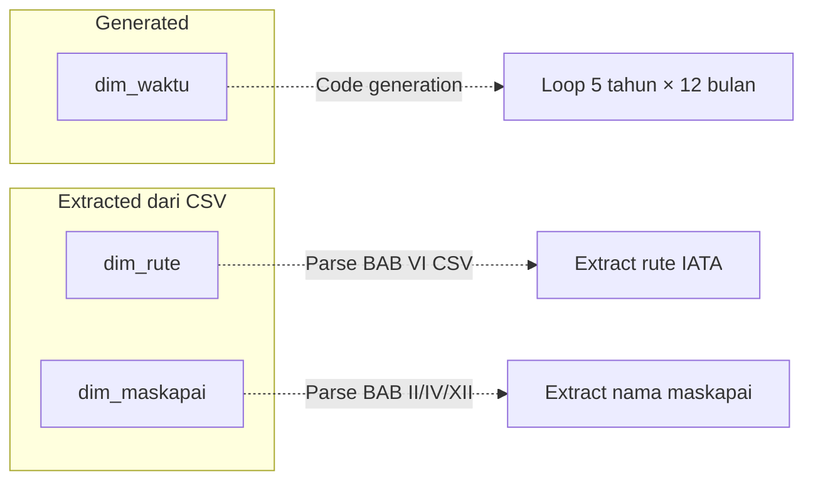

#### Keterkaitan dengan Dim/Fact Lainnya

`dim_waktu` adalah **HUB** yang menghubungkan SEMUA fact tables:

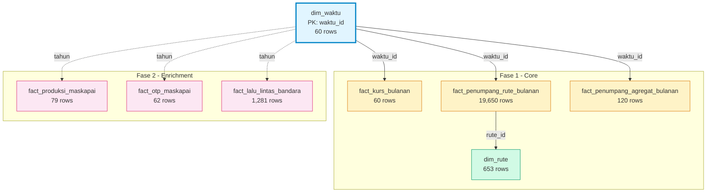

**Keterangan warna:**
- 🟦 **Biru** = Dimension (HUB utama)
- 🟨 **Kuning** = Fact tables Fase 1 (Core — untuk korelasi)
- 🟩 **Hijau** = Dimension pendukung
- 🟪 **Pink** = Fact tables Fase 2 (Enrichment — konteks tambahan)

**Fact tables yang terkoneksi:**

| Fact Table | Join Key | Tipe |
|---|---|---|
| `fact_kurs_bulanan` | `waktu_id = waktu_id` | Direct FK |
| `fact_penumpang_rute_bulanan` | `waktu_id = waktu_id` | Direct FK |
| `fact_penumpang_agregat_bulanan` | `waktu_id = waktu_id` | Direct FK |
| `fact_produksi_maskapai` | `tahun = tahun` | Indirect (tahun only) |
| `fact_lalu_lintas_bandara` | `tahun = tahun` | Indirect (tahun only) |
| `fact_otp_maskapai` | `tahun = tahun` | Indirect (tahun only) |

#### Bagaimana Dimensi Ini Tercipta?

Dari script `01_dim_waktu.py`:

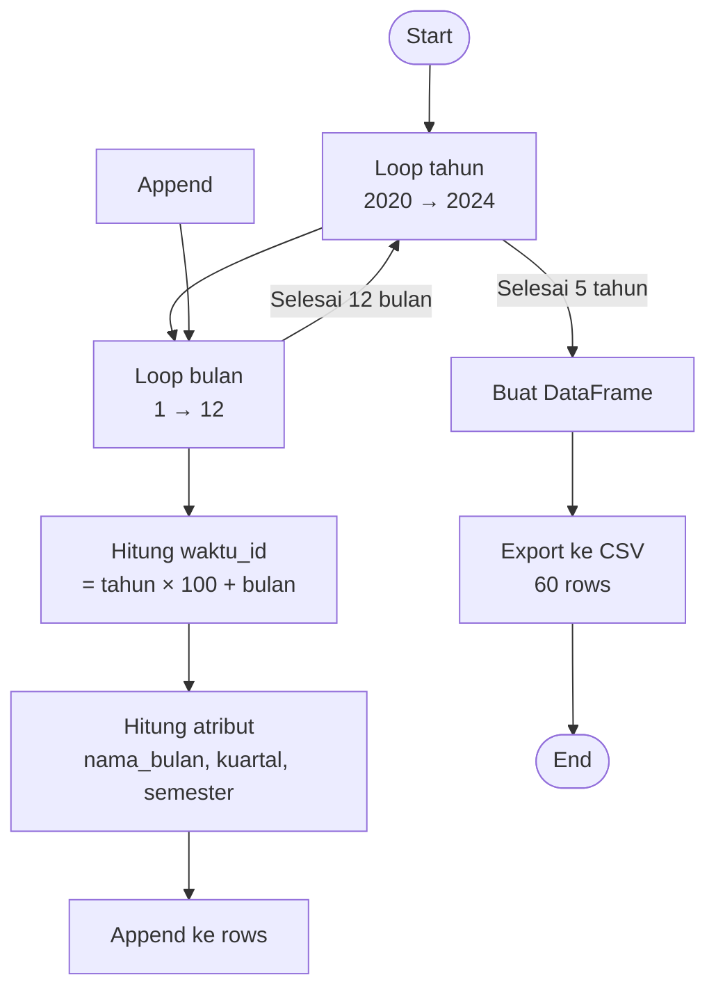

**Proses:**
1. Loop tahun 2020 → 2024
2. Untuk tiap tahun, loop bulan 1 → 12
3. Generate `waktu_id` (contoh: 2020 × 100 + 1 = **202001**)
4. Hitung atribut waktu (kuartal, semester, nama bulan)
5. Simpan sebagai DataFrame → export ke CSV

#### Kenapa Totalnya Ada 60?

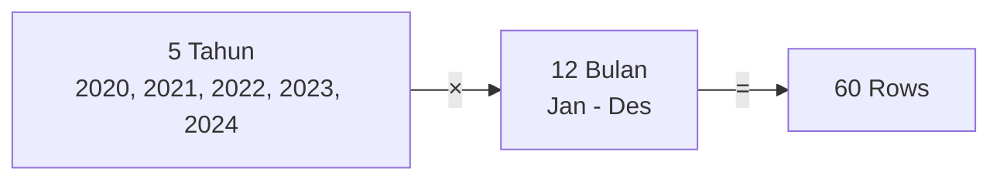

Perhitungannya sederhana:
- **5 tahun** (2020, 2021, 2022, 2023, 2024)
- **12 bulan per tahun**
- **5 × 12 = 60 baris**

Ini mencakup **seluruh periode analisis** proyek kita.

#### Penjelasan Kolom

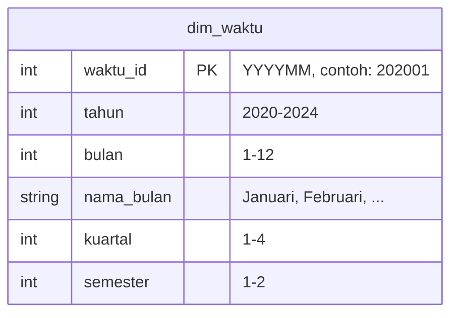

| Kolom | Tipe | Contoh | Alasan Dibuat |
|---|---|---|---|
| **`waktu_id`** | INT (PK) | `202001` | **Primary Key** — format YYYYMM untuk join dengan fact tables |
| **`tahun`** | INT | `2020` | Memudahkan filter di Tableau tanpa perlu parse `waktu_id` |
| **`bulan`** | INT | `1` | Memudahkan filter/sort per bulan (1-12) |
| **`nama_bulan`** | STRING | `"Januari"` | Untuk display di visualisasi (bukan angka) |
| **`kuartal`** | INT | `1` | Untuk agregasi per kuartal (Q1-Q4) |
| **`semester`** | INT | `1` | Untuk agregasi per semester (S1-S2) |

#### Mengapa Kolom-Kolom Ini Dibuat Begitu?

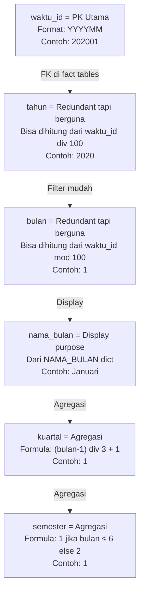

**`waktu_id` — Yang paling penting**
- Format `YYYYMM` (contoh: `202001` untuk Jan 2020)
- Memungkinkan **sorting otomatis** (202001 < 202002 < ... < 202412)
- Sebagai **FK** di semua fact tables bulanan
- Unique identifier untuk setiap bulan

**`tahun` & `bulan` — Redundant tapi berguna**
- Sebenarnya bisa dihitung dari `waktu_id`:
  - `tahun = waktu_id // 100`
  - `bulan = waktu_id % 100`
- Tapi **sengaja ditambahkan** karena:
  - Lebih mudah filter di Tableau (`tahun = 2023` vs `waktu_id BETWEEN 202301 AND 202312`)
  - Lebih readable untuk user

**`nama_bulan` — Untuk display**
- Tableau bisa pakai ini untuk label di chart
- "Januari" lebih mudah dibaca daripada "1"

**`kuartal` & `semester` — Untuk agregasi**
- Memungkinkan analisis per kuartal tanpa perlu logic tambahan
- Contoh: "Bagaimana tren penumpang di Q1 vs Q4?"

#### Contoh Penggunaan di Tableau

Setelah load ke Tableau:

**Scenario 1:** Plot kurs vs penumpang per bulan
```
X-axis: dim_waktu.tahun + dim_waktu.bulan (atau nama_bulan)
Y-axis 1: fact_kurs.avg_kurs_tengah
Y-axis 2: fact_penumpang_agregat.total_penumpang
```

**Scenario 2:** Filter tahun tertentu
```
Filter: dim_waktu.tahun = 2023
→ Langsung dapat 12 baris (Jan-Des 2023)
```

**Scenario 3:** Agregasi per kuartal
```
Group by: dim_waktu.kuartal
Measure: SUM(total_penumpang), AVG(avg_kurs_tengah)
```

#### Kesimpulan

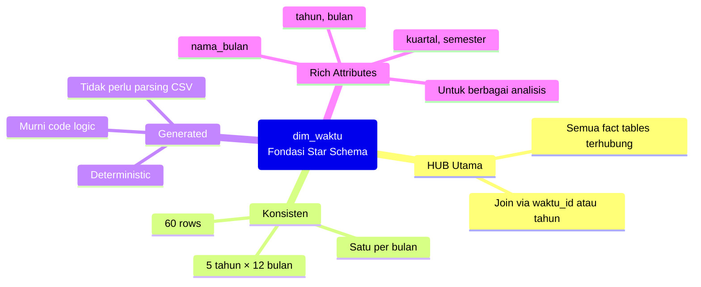

`dim_waktu` adalah **fondasi** dari seluruh star schema karena:
1. ✅ **HUB utama** — semua fact tables terhubung lewat ini
2. ✅ **Konsisten** — 60 baris, satu untuk setiap bulan dalam 5 tahun
3. ✅ **Generated** — tidak perlu parsing CSV, murni logic
4. ✅ **Rich attributes** — tahun, bulan, nama, kuartal, semester untuk berbagai keperluan analisis

---

### Q2: Apa maksud dari "redundant tapi berguna"? Siapa saja yang akan terdampak oleh redundant ini? Kalau mau tidak redundant maka seperti apa? Apakah ini mempengaruhi struktur `dim_waktu`? Bagaimana keterhubungan mereka nantinya?

**A:**

#### Apa Itu "Redundant tapi Berguna"?

Dalam konteks `dim_waktu`, kolom `tahun` dan `bulan` disebut **redundant** karena informasi tersebut **sudah tersimpan** di dalam `waktu_id`.

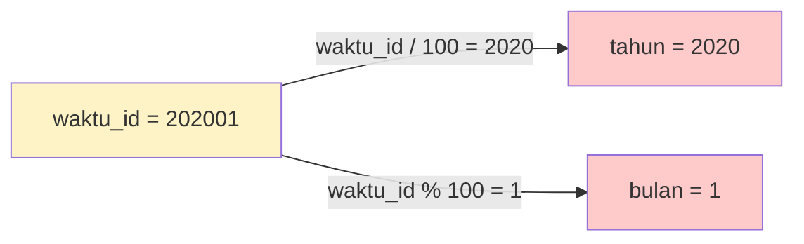

**Contoh:**
- `waktu_id = 202001` → sudah mengandung tahun `2020` dan bulan `1`
- `tahun = 2020` → **redundant** (sudah ada di `waktu_id`)
- `bulan = 1` → **redundant** (sudah ada di `waktu_id`)

Tapi tetap dibuat sebagai kolom terpisah karena **bermanfaat** untuk kemudahan penggunaan.

---

#### Siapa yang Terdampak oleh Redundansi Ini?

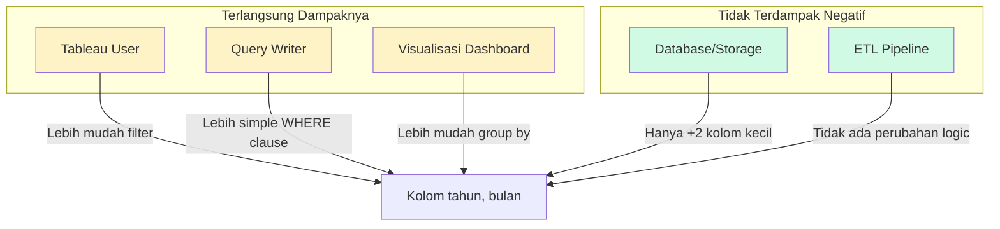

**Yang terdampak (positif):**

| Pihak | Sebelum (Tanpa Redundant) | Sesudah (Dengan Redundant) |
|---|---|---|
| **Tableau User** | `Filter: waktu_id BETWEEN 202301 AND 202312` | `Filter: tahun = 2023` |
| **Query Writer** | `SELECT * WHERE waktu_id >= 202301 AND waktu_id <= 202312` | `SELECT * WHERE tahun = 2023` |
| **Dashboard** | Harus buat calculated field untuk extract tahun/bulan | Langsung drag & drop kolom `tahun` atau `bulan` |

**Yang TIDAK terdampak negatif:**

| Pihak | Alasan |
|---|---|
| **Storage** | Hanya +2 kolom integer → ~60 × 8 bytes = ~480 bytes (sangat kecil) |
| **ETL Pipeline** | Logic generate tetap sama, hanya tambah 2 kolom output |
| **Integritas Data** | Karena generated, tidak ada risiko inkonsistensi |

---

#### Kalau Mau Tidak Redundant, Seperti Apa?

Versi **non-redundant** dari `dim_waktu`:

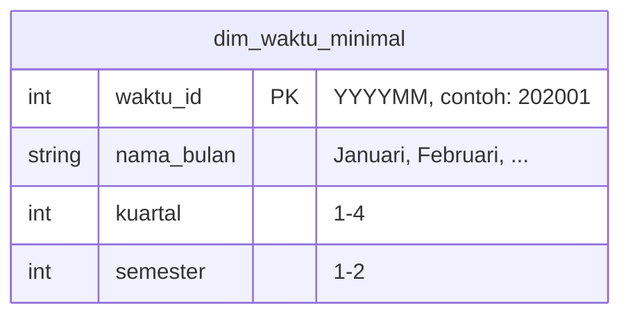

**Strukturnya hanya:**
| Kolom | Tipe | Contoh |
|---|---|---|
| `waktu_id` | INT (PK) | `202001` |
| `nama_bulan` | STRING | `"Januari"` |
| `kuartal` | INT | `1` |
| `semester` | INT | `1` |

**Kolom `tahun` dan `bulan` DIHAPUS** karena bisa dihitung dari `waktu_id`.

---

#### Apakah Ini Mempengaruhi Struktur `dim_waktu`?

Ya, strukturnya berubah:

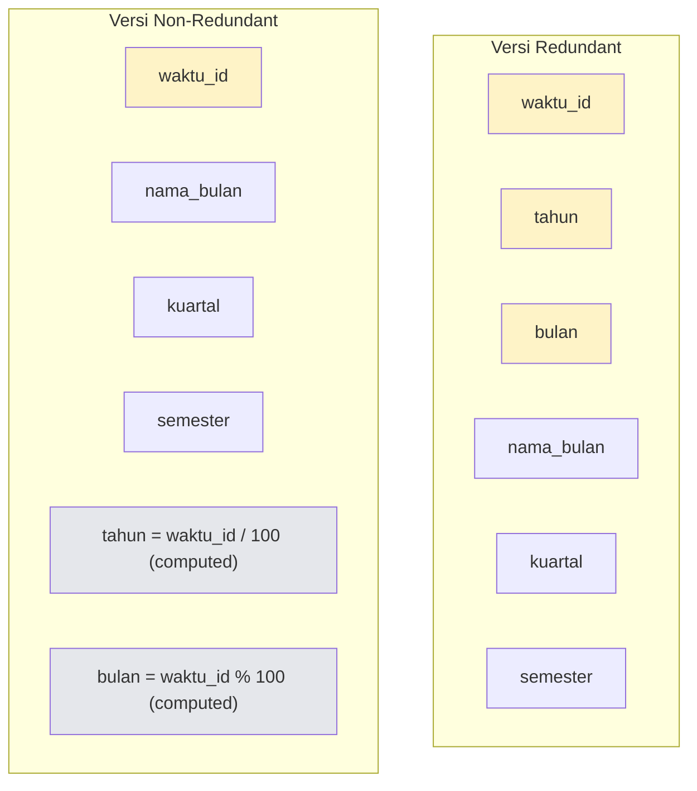

---

#### Bagaimana Keterhubungan Mereka Nantinya?

**Dengan Redundant (Current Design):**

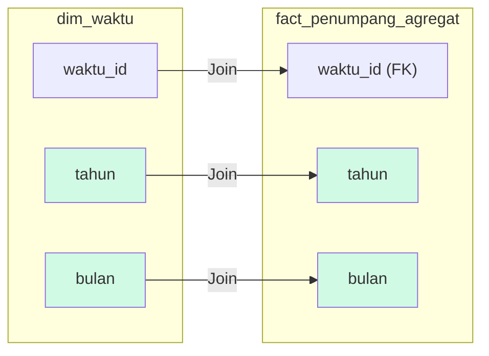

Join di Tableau bisa pakai:
- `dim_waktu.waktu_id = fact.waktu_id` (primary join)
- **ATAU** `dim_waktu.tahun = fact.tahun AND dim_waktu.bulan = fact.bulan` (alternative)

**Tanpa Redundant (Non-Redundant Design):**

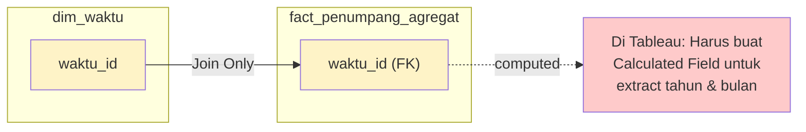

Join di Tableau **HANYA** bisa pakai:
- `dim_waktu.waktu_id = fact.waktu_id`
- Untuk filter tahun → harus buat **Calculated Field**: `INT([waktu_id] / 100)`

---

#### Perbandingan: Redundant vs Non-Redundant

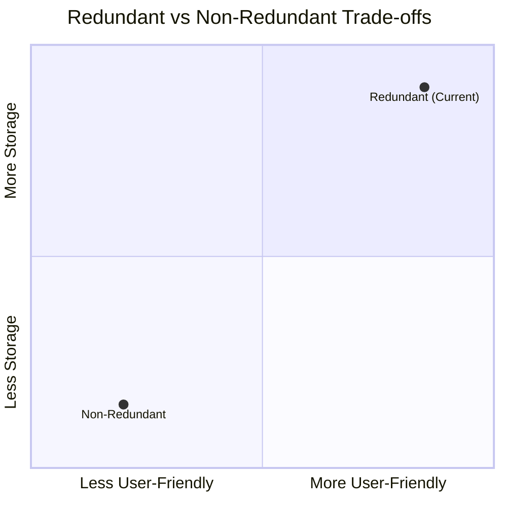

| Aspek | Redundant ✅ | Non-Redundant ❌ |
|---|---|---|
| **Kemudahan Filter** | `tahun = 2023` | `waktu_id BETWEEN 202301 AND 202312` |
| **Kemudahan Group By** | `GROUP BY tahun` | `GROUP BY INT(waktu_id/100)` |
| **Tableau Calculated Field** | Tidak perlu | Perlu untuk extract tahun/bulan |
| **Storage** | +480 bytes (negligible) | Minimal |
| **Risk of Inconsistency** | Nol (generated) | Nol |
| **Readability** | Tinggi | Rendah |

---

#### Kesimpulan

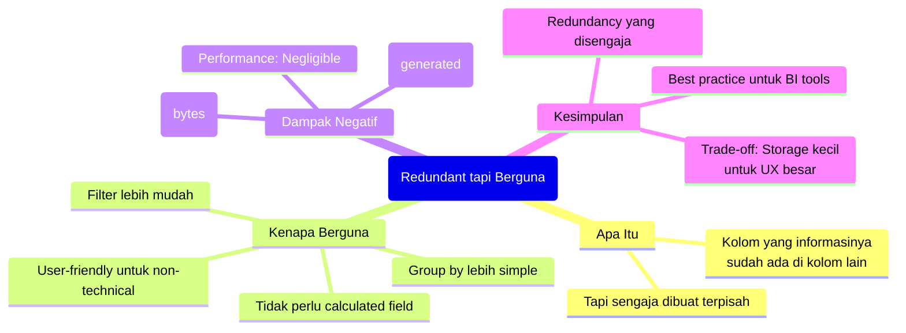

**Redundancy di `dim_waktu` adalah desain yang disengaja** — mengorbankan storage yang sangat kecil (hanya beberapa ratus bytes) untuk mendapatkan **kemudahan penggunaan yang jauh lebih besar**, terutama di tools BI seperti Tableau.

---

### Q3: Dari mana `fact_penumpang_rute_bulanan.csv` dan `fact_lalu_lintas_bandara.csv` dibuat? Apakah keduanya merujuk ke sumber CSV mentah yang sama? Kenapa harus dipisah? Apakah keduanya saling berhubungan? Apakah `fact_lalu_lintas_bandara.csv` bersifat tahunan dan hanya menggunakan nama bandara?

**A:**

#### Sumber Data Berbeda

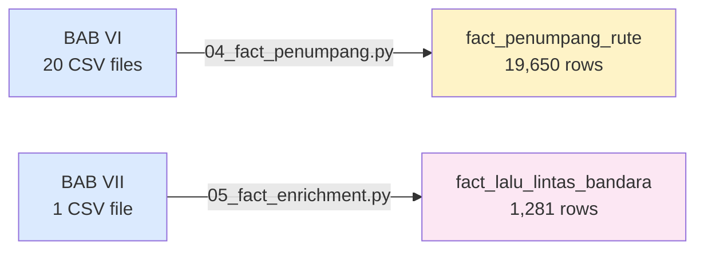

**TIDAK dari sumber yang sama!**

| Aspek | `fact_penumpang_rute` | `fact_lalu_lintas_bandara` |
|---|---|---|
| **Sumber** | BAB VI (20 files) | BAB VII (1 file) |
| **Granularitas** | Rute (pasangan bandara) | Bandara (individual) |
| **Waktu** | Bulanan (60 periode) | Tahunan (5 tahun) |
| **Isi** | Jumlah penumpang | Penumpang + barang + pesawat |
| **Join** | `dim_waktu`, `dim_rute` | `dim_waktu` (via tahun saja) |

---

#### Kenapa Dipisah & Apakah Saling Berhubungan?

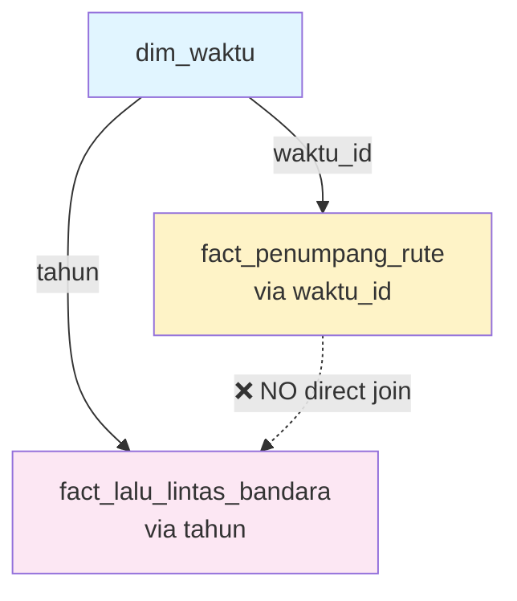

**Tidak ada direct join** — hanya terhubung tidak langsung via `dim_waktu` (tahun).

---

#### Apakah Tahunan & Hanya Nama Bandara?

**YA** — hanya `tahun`, tidak ada `bulan`/`waktu_id`.

**TIDAK** — bukan hanya nama bandara, tapi juga: propinsi, kota, tipe_penerbangan, penumpang (datang/berangkat/transit/total), barang (kg), bagasi (kg), pesawat (datang/berangkat).

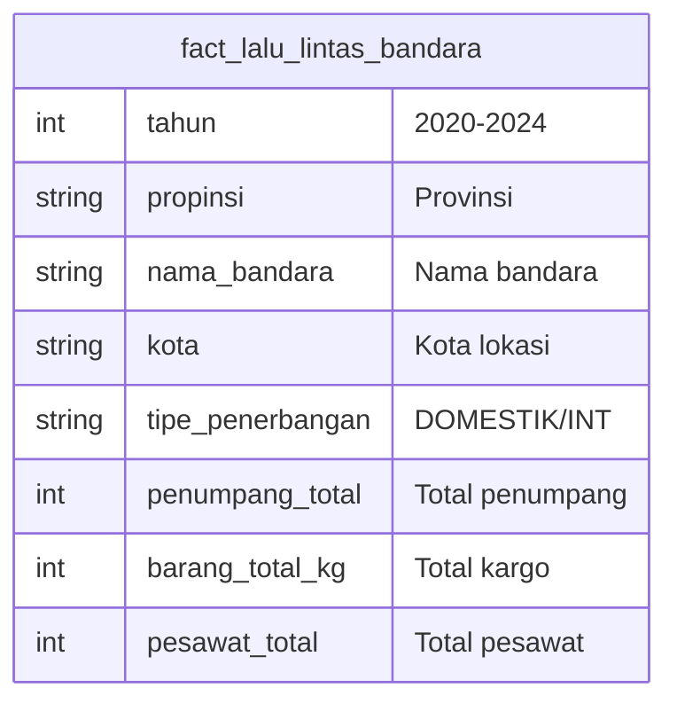

---

### Q4: Kenapa di `fact_penumpang_rute_bulanan.csv` tidak ada nama bandara? Apakah karena 'rute' berbeda 'bandara' itu secara makna berbeda? Lalu, apa perbedaan fungsi masing-masing fact table itu? Apakah keduanya saling mendukung, atau justru memang memiliki tujuan yang sangat berbeda?

**A:**

#### Kenapa Tidak Ada Nama Bandara?

Karena **rute ≠ bandara** — mereka konsep berbeda.

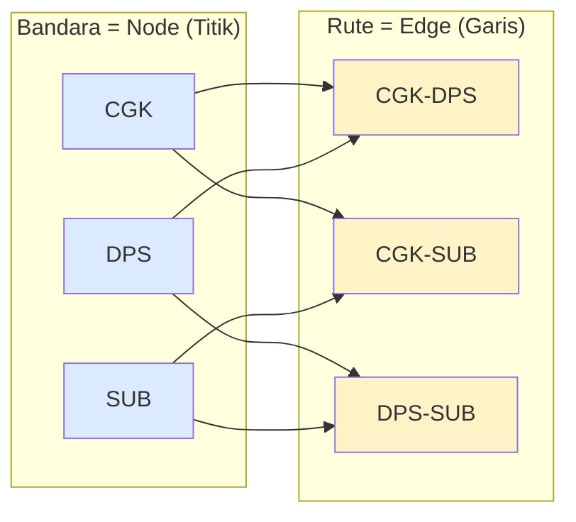

| Konsep | Definisi | Contoh |
|---|---|---|
| **Bandara** | Titik/lokasi fisik | CGK — Soekarno Hatta |
| **Rute** | Pasangan 2 bandara | CGK-DPS (Jakarta → Denpasar) |

Nama bandara tidak disimpan di `fact_penumpang_rute` karena:
1. ✅ Sudah encoded di `rute_id` (CGK-DPS)
2. ✅ Bisa join ke `dim_rute` untuk `kota_a`, `kota_b`
3. ✅ Denormalisasi = redundansi

---

#### Perbedaan Fungsi

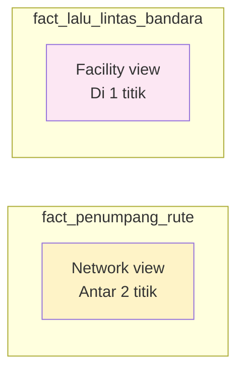

| Aspek | `fact_penumpang_rute` | `fact_lalu_lintas_bandara` |
|---|---|---|
| **Fungsi** | Analisis pergerakan antar 2 titik | Analisis aktivitas di 1 titik |
| **Granularitas** | Rute (pasangan) | Bandara (individual) |
| **Waktu** | Bulanan | Tahunan |
| **Tujuan** | **Core** — korelasi kurs | **Enrichment** — infrastruktur |

---

#### Saling Mendukung atau Berbeda Tujuan?

**Berbeda tujuan TAPI bisa saling melengkapi:**

```mermaid
flowchart TD
    T1["Korelasi kurs vs penumpang"]
    T2["Infrastruktur bandara"]
    M1["Cross-analysis:<br/>Dampak kurs ke bandara tertentu?"]
    
    T1 --> M1
    T2 --> M1
    
    style T1 fill:#fef3c7
    style T2 fill:#fce7f3
    style M1 fill:#d1fae5
```

| Insight | Data Dibutuhkan |
|---|---|
| "Rute CGK-DPS paling ramai?" | `fact_penumpang_rute` only |
| "Total penumpang di CGK 2023?" | `fact_lalu_lintas_bandara` only |
| "Dampak kurs naik ke bandara CGK?" | **Keduanya** digabung |

---

### Q5: Jelaskan perbedaan `fact_penumpang_agregat_bulanan.csv` dengan `fact_penumpang_rute_bulanan.csv`!

**A:**

#### Inti Perbedaan: Detail vs Ringkasan

```mermaid
flowchart LR
    subgraph "fact_penumpang_rute_bulanan (Detail)"
        R1["202001, CGK-DPS, DOM, 363789"]
        R2["202001, CGK-JOG, DOM, 167101"]
        R3["202001, CGK-SUB, DOM, 317744"]
        R4["... 19,650 rows total"]
    end
    
    subgraph "fact_penumpang_agregat_bulanan (Ringkasan)"
        A1["202001, DOM, 6832548, 365 rute"]
        A2["202001, INT, 3275634, 141 rute"]
        A3["... 120 rows total"]
    end
    
    R1 -->|SUM & COUNT| A1
    R2 -->|SUM & COUNT| A1
    R3 -->|SUM & COUNT| A1
    
    style R1 fill:#fef3c7
    style R2 fill:#fef3c7
    style R3 fill:#fef3c7
    style R4 fill:#fef3c7
    style A1 fill:#d1fae5
    style A2 fill:#d1fae5
    style A3 fill:#d1fae5
```

**`fact_penumpang_rute`** = detail per rute  
**`fact_penumpang_agregat`** = total per bulan (DOM & INT)

---

#### Perbandingan Langsung

| Aspek | `fact_penumpang_rute_bulanan` | `fact_penumpang_agregat_bulanan` |
|---|---|---|
| **Granularitas** | Per **rute** (CGK-DPS, CGK-JOG, dll) | Per **kategori** (DOM/INT) |
| **Rows** | **19,650** | **120** |
| **Kolom** | `waktu_id`, `rute_id`, `kategori`, `jumlah_penumpang` | `waktu_id`, `tahun`, `bulan`, `kategori`, `total_penumpang`, `jumlah_rute_aktif` |
| **Level** | **Detail** — bisa lihat tiap rute | **Summary** — total semua rute |
| **Untuk Apa** | Drill-down, analisis per rute | Overview, korelasi kurs vs total |

---

#### Bagaimana Agregat Terbentuk dari Rute?

```mermaid
flowchart TD
    subgraph "fact_penumpang_rute (Jan 2020, DOM)"
        R1["CGK-DPS: 363,789"]
        R2["CGK-JOG: 167,101"]
        R3["CGK-SUB: 317,744"]
        R4["CGK-SIN: 334,069"]
        R5["... 365 routes total"]
    end
    
    subgraph "fact_penumpang_agregat (Jan 2020, DOM)"
        A1["total_penumpang: 6,832,548"]
        A2["jumlah_rute_aktif: 365"]
    end
    
    R1 -->|SUM| A1
    R2 -->|SUM| A1
    R3 -->|SUM| A1
    R4 -->|SUM| A1
    R5 -->|COUNT| A2
    
    style R1 fill:#fef3c7
    style R2 fill:#fef3c7
    style R3 fill:#fef3c7
    style R4 fill:#fef3c7
    style R5 fill:#fef3c7
    style A1 fill:#d1fae5
    style A2 fill:#d1fae5
```

**Proses agregasi:**
```python
# Dari fact_penumpang_rute_bulanan:
df_agregat = df.groupby(['waktu_id', 'kategori']).agg(
    total_penumpang=('jumlah_penumpang', 'sum'),      # SUM semua rute
    jumlah_rute_aktif=('jumlah_penumpang', 'count')   # COUNT rute aktif
).reset_index()

# Tambah kolom redundan untuk kemudahan Tableau:
df_agregat['tahun'] = df_agregat['waktu_id'] // 100
df_agregat['bulan'] = df_agregat['waktu_id'] % 100
```

---

#### Contoh Data

**`fact_penumpang_rute_bulanan` (detail):**
```
waktu_id  rute_id   kategori    jumlah_penumpang
202001    CGK-DPS   DOMESTIK    363,789
202001    CGK-JOG   DOMESTIK    167,101
202001    CGK-SUB   DOMESTIK    317,744
202001    CGK-SIN   INT         334,069
...       ...       ...         ...
(19,650 rows)
```

**`fact_penumpang_agregat_bulanan` (summary):**
```
waktu_id  tahun  bulan  kategori       total_penumpang  jumlah_rute_aktif
202001    2020   1      DOMESTIK       6,832,548        365
202001    2020   1      INTERNASIONAL  3,275,634        141
202002    2020   2      DOMESTIK       6,274,742        360
202002    2020   2      INTERNASIONAL  2,308,921        125
...       ...    ...    ...            ...              ...
(120 rows = 60 bulan × 2 kategori)
```

---

#### Kapan Pakai yang Mana?

```mermaid
flowchart TD
    Q["Pertanyaan Analisis"]
    
    Q -->|"Rute mana paling ramai?"| R["fact_penumpang_rute"]
    Q -->|"Tren penumpang CGK-DPS?"| R
    Q -->|"Drill-down per rute?"| R
    
    Q -->|"Total penumpang DOMESTIK?"| A["fact_penumpang_agregat"]
    Q -->|"Korelasi kurs vs total?"| A
    Q -->|"Overview industri?"| A
    
    style Q fill:#e1f5ff
    style R fill:#fef3c7
    style A fill:#d1fae5
```

| Use Case | Pakai | Alasan |
|---|---|---|
| Scatter plot korelasi kurs vs penumpang | **Agregat** | Butuh total per bulan |
| Dual-axis time series kurs + penumpang | **Agregat** | Trend line lebih clean |
| Top 10 rute paling ramai | **Rute** | Perlu detail per rute |
| Analisis tren rute spesifik | **Rute** | Bisa filter per rute_id |
| Dashboard overview | **Agregat** | Ringkasan cepat |
| Deep dive analysis | **Rute** | Detail granular |

---

#### Kesimpulan

```mermaid
mindmap
  root(Perbedaan Kedua Fact Table)
    fact_penumpang_rute_bulanan
      19,650 rows
      Detail per rute
      Untuk drill-down
      Bisa analisis per rute spesifik
      fact_penumpang_agregat dibuat dari ini
    fact_penumpang_agregat_bulanan
      120 rows
      Summary per kategori
      Untuk overview & korelasi
      Total DOM/INT per bulan
      Titik utama korelasi kurs
    Hubungan
      Agregat = GROUP BY dari Rute
      SUM jumlah_penumpang
      COUNT jumlah_rute_aktif
      Keduanya dari BAB VI
```

| Pertanyaan | Jawaban |
|---|---|
| Sama-sama dari BAB VI? | ✅ **Ya** — sumber sama, level agregasi beda |
| Agregat dari mana? | ✅ **GROUP BY** dari `fact_penumpang_rute_bulanan` |
| Pakai yang mana? | **Agregat** untuk korelasi, **Rute** untuk drill-down |
| Saling menggantikan? | ❌ **Tidak** — komplementer |

---

*(Akan ditambahkan sesuai pertanyaan yang masuk)*

---

### Q6: `fact_penumpang_agregat_bulanan.csv` sebenarnya bisa langsung diturunkan dari `fact_penumpang_rute_bulanan.csv` yah? Kenapa kita buatkan tablenya? Kenapa gak langsung aja di Tableau?

**A:**

#### Betul, Agregat Bisa Dihitung di Tableau!

```mermaid
flowchart LR
    A["fact_penumpang_rute<br/>19,650 rows"]
    B{Hitung agregasi<br/>di Tableau?}
    C["fact_penumpang_agregat<br/>120 rows"]
    
    A -->|"Ya, bisa"| B
    B -->|GROUP BY| C
    
    style A fill:#fef3c7
    style B fill:#e1f5ff
    style C fill:#d1fae5
```

**Pertanyaan bagus!** Secara teknis, **Tableau BISA** menghitung agregasi dari `fact_penumpang_rute_bulanan`:

```
# Di Tableau (Calculated Field):
SUM([jumlah_penumpang])  → total per bulan
COUNT([rute_id])         → jumlah rute aktif
```

**Tapi kita tetap buat table terpisah karena beberapa alasan:**

---

#### Alasan Pre-Agregasi di ETL (Bukan di Tableau)

```mermaid
mindmap
  root(Kenapa Pre-Agregasi?)
    Performance
      120 rows vs 19,650 rows
      Load lebih cepat
      Query lebih ringan
    Simplicity
      Drag-and-drop langsung
      Tidak perlu calculated field
      User-friendly untuk non-technical
    Star Schema Best Practice
      Aggregate fact table = common pattern
      Separate concern: detail vs summary
      Multiple granularity levels
    Data Quality
      Sudah diverifikasi di ETL
      Consistent calculation
      Tidak bergantung pada user membuat formula benar
    Portability
      Bisa dipakai tanpa Tableau
      Bisa untuk reporting lain
      Standalone file
```

---

#### Perbandingan Langsung

| Aspek | **Pre-Agregasi (ETL)** | **Agregasi di Tableau** |
|---|---|---|
| **Performance** | ✅ Load 120 rows (instant) | ⚠️ Load 19,650 rows + compute |
| **Kemudahan** | ✅ Drag-and-drop kolom | ⚠️ Harus buat calculated field |
| **User Skill** | ✅ Non-technical bisa | ⚠️ Perlu paham Tableau calc |
| **Risk of Error** | ✅ Sudah diverifikasi di Python | ⚠️ User bisa salah formula |
| **Portability** | ✅ CSV standalone | ❌ Hanya di workbook Tableau |
| **Flexibility** | ⚠️ Fixed aggregation | ✅ Bisa custom aggregation |
| **Storage** | ⚠️ +4KB untuk CSV terpisah | ✅ Tidak perlu file tambahan |

---

#### Contoh Use Case

**Dengan Pre-Agregasi (Current Design):**
```
User buka Tableau → Load fact_penumpang_agregat.csv (120 rows)
→ Drag tahun, bulan ke Columns
→ Drag total_penumpang ke Rows
→ Selesai, chart langsung jadi!
```

**Tanpa Pre-Agregasi (Alternative):**
```
User buka Tableau → Load fact_penumpang_rute.csv (19,650 rows)
→ Buat calculated field: SUM([jumlah_penumpang])
→ Drag tahun, bulan ke Columns
→ Drag calculated field ke Rows
→ Harus pastikan group by benar (waktu_id + kategori)
→ Chart jadi, tapi lebih ribet
```

---

#### Star Schema Best Practice

```mermaid
flowchart TD
    subgraph "Star Schema Pattern"
        F1["Fact Table (Detail)<br/>Granularitas terendah"]
        F2["Aggregate Fact Table<br/>Granularitas lebih tinggi"]
    end
    
    F1 -->|Pre-computed| F2
    
    note["Common pattern di DW:<br/>- Fact Sales (per transaction)<br/>- Fact Sales Monthly (agregat)"]
    
    F2 -.-> note
    
    style F1 fill:#fef3c7
    style F2 fill:#d1fae5
```

**Ini adalah pattern umum di Data Warehouse:**
- `fact_sales` (per transaksi) → `fact_sales_daily` (per hari) → `fact_sales_monthly` (per bulan)
- `fact_penumpang_rute` (per rute) → `fact_penumpang_agregat` (per bulan)

**Kenapa?** Karena **berbeda level granularity** → berbeda use case → berbeda performance profile.

---

#### Kapan Pakai yang Mana?

```mermaid
flowchart TD
    Q["Pertanyaan: Kapan harus pre-agregasi?"]
    
    Q -->|"Data besar (>100K rows)"| A["✅ Ya, pre-aggregasi"]
    Q -->|"User non-technical"| A
    Q -->|"Performance critical"| A
    
    Q -->|"Data kecil (<10K rows)"| B["❌ Tidak perlu"]
    Q -->|"User advanced"| B
    Q -->|"Butuh flexibility tinggi"| B
    
    style Q fill:#e1f5ff
    style A fill:#d1fae5
    style B fill:#fecaca
```

**Untuk proyek ini:**
- ✅ **Pre-agregasi dipilih** karena:
  1. Data 19,650 rows (cukup besar untuk Tableau)
  2. Target user: dosen/penguji (mau langsung lihat hasil)
  3. Performance penting (demo/presentasi)
  4. Best practice DW (aggregate fact table)

---

#### Kesimpulan

| Pertanyaan | Jawaban |
|---|---|
| Bisa gak di Tableau? | ✅ **Bisa** — Tableau bisa GROUP BY |
| Kenapa tetap dibuat table? | **Performance + Simplicity + Best Practice** |
| Kapan pakai pre-agregat? | Data besar, user non-technical, performance critical |
| Kapan hitung di Tableau? | Data kecil, user advanced, butuh flexibility |
| Ini common pattern? | ✅ **Ya** — aggregate fact table = standard DW pattern |

**Intinya:** Kita **bisa** hitung di Tableau, tapi kita **pilih** pre-agregasi karena lebih praktis, lebih cepat, dan mengikuti best practice data warehousing.

---

*(Akan ditambahkan sesuai pertanyaan yang masuk)*

---

*File ini akan terus terupdate ketika ada pertanyaan baru.*
