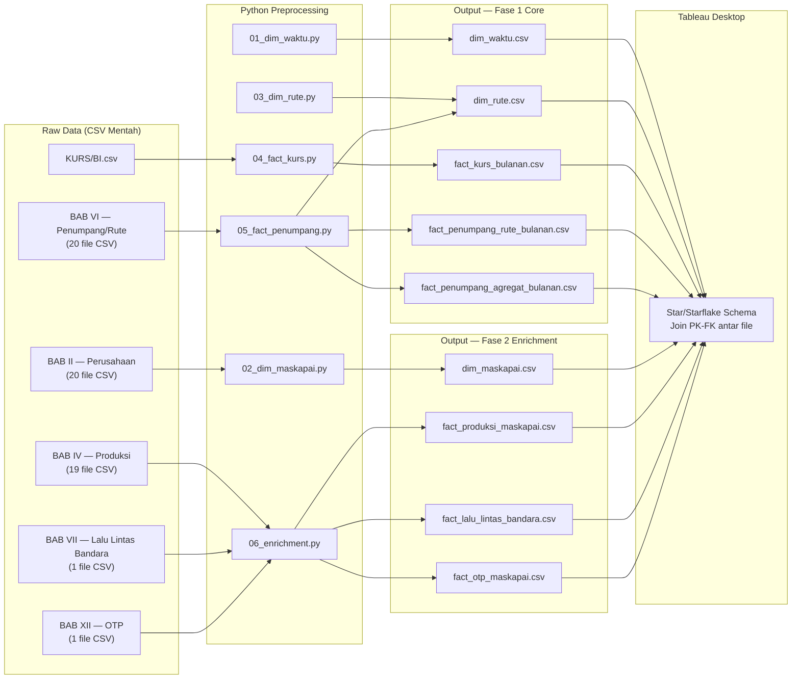
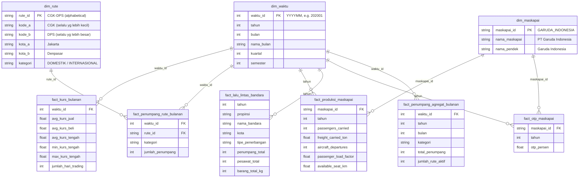

# Implementation Plan v2.2 (Final) — Jalur A
# Data Warehouse: Korelasi Nilai Rupiah terhadap Angkutan Udara Indonesia (2020–2024)

> [!IMPORTANT]
> **ROMBAK TOTAL** dari plan v1. Tidak lagi menggunakan PostgreSQL/Neon. Mengikuti pendekatan dosen:
> `CSV Mentah → Python Preprocessing → File CSV/Excel Bersih (dim & fact) → Tableau → Sambung PK-FK → Visualisasi`

> [!NOTE]
> **v2.2 (final)**: v2.1 + 4 polish terakhir — `kota_a/kota_b` di dim_rute (bukan asal/tujuan), `tahun`+`bulan` di agregat, folder output per fase, edge case parsing BAB VII.

### Keputusan Prioritas (RESOLVED)

**Fase 1 — Core (WAJIB):** 5 file output untuk analisis korelasi langsung:
- `dim_waktu.csv`, `dim_rute.csv`
- `fact_kurs_bulanan.csv`, `fact_penumpang_rute_bulanan.csv`, `fact_penumpang_agregat_bulanan.csv`

**Fase 2 — Enrichment (JIKA WAKTU CUKUP):** 4 file tambahan:
- `dim_maskapai.csv`
- `fact_produksi_maskapai.csv`, `fact_otp_maskapai.csv`, `fact_lalu_lintas_bandara.csv`

---

## 1. ARSITEKTUR — Jalur A



---

## 2. STAR SCHEMA DESIGN

### 2.1 Gambaran Skema



### 2.2 Mengapa Skema Ini?

| Keputusan Desain | Alasan |
|---|---|
| **2 core facts** (kurs + penumpang) | Ini yang di-korelasikan — keduanya bulanan |
| **3 enrichment facts** (produksi, OTP, bandara) | Tahunan, bukan core tapi memperkaya analisis |
| **dim_waktu sebagai hub** | Menghubungkan semua fact — kunci join utama di Tableau |
| **dim_rute** | Memungkinkan drill-down per rute di BAB VI |
| **dim_maskapai** | Menghubungkan produksi & OTP ke maskapai yang sama |
| **fact_lalu_lintas_bandara tanpa dim_bandara terpisah** | Data bandara hanya dari 1 sumber (BAB VII), cukup denormalisasi |

---

## 3. DETAIL OUTPUT FILES

### 3.1 Dimension Files

#### `dim_waktu.csv` — Generated (bukan dari CSV)

| Kolom | Tipe | Contoh | Keterangan |
|---|---|---|---|
| `waktu_id` | INT (PK) | `202001` | Format YYYYMM |
| `tahun` | INT | `2020` | |
| `bulan` | INT | `1` | 1-12 |
| `nama_bulan` | STRING | `Januari` | |
| `kuartal` | INT | `1` | 1-4 |
| `semester` | INT | `1` | 1-2 |

**Total baris: 60** (2020-01 s/d 2024-12)

---

#### `dim_rute.csv` — Dari BAB VI (extracted)

| Kolom | Tipe | Contoh | Keterangan |
|---|---|---|---|
| `rute_id` | STRING (PK) | `CGK-DPS` | **Alphabetical order** — kode kecil dulu |
| `kode_a` | STRING | `CGK` | IATA code yang lebih kecil secara alfabet |
| `kode_b` | STRING | `DPS` | IATA code yang lebih besar secara alfabet |
| `kota_a` | STRING | `Jakarta` | Kota untuk kode_a (dari 2020-2021, NULL jika tidak ada) |
| `kota_b` | STRING | `Denpasar` | Kota untuk kode_b (dari 2020-2021, NULL jika tidak ada) |
| `kategori` | STRING | `DOMESTIK` | DOMESTIK / INTERNASIONAL |

**Total baris: ~500-600** (unique rute setelah normalisasi PP, dari 5 tahun DOM+INT)

> [!IMPORTANT]
> **Normalisasi Rute PP:** Karena data DJPU menggunakan "(PP)" = Pulang Pergi, rute `CGK-DPS` dan `DPS-CGK` adalah rute yang sama. Kita normalisasi dengan **selalu mengurutkan kode IATA secara alphabetical**:
> - `DPS-CGK` → `CGK-DPS` (C < D)
> - `UPG-SUB` → `SUB-UPG` (S < U)
> - `SIN-CGK` → `CGK-SIN` (C < S)
>
> Ini mencegah duplikasi di dim_rute dan menyederhanakan analisis.

> [!WARNING]
> **Semantik kota_a / kota_b:** Karena rute sudah dinormalisasi alphabetical, kolom `kota_a` dan `kota_b` **BUKAN** berarti "kota asal" dan "kota tujuan". Keduanya hanya menunjukkan pasangan kota dalam rute tersebut. Interpretasi di Tableau harus sebagai "Kota A" dan "Kota B", bukan arah penerbangan.

---

#### `dim_maskapai.csv` — Dari BAB II + BAB IV + BAB XII (merged)

| Kolom | Tipe | Contoh | Keterangan |
|---|---|---|---|
| `maskapai_id` | STRING (PK) | `GARUDA_INDONESIA` | Nama normalized → uppercase, underscore |
| `nama_maskapai` | STRING | `PT Garuda Indonesia` | Nama lengkap resmi (standar) |
| `nama_pendek` | STRING | `Garuda Indonesia` | Tanpa prefix PT |

**Total baris: ~20** (master list maskapai unik)

**Mapping standardisasi nama:**
```
"PT Pelita Air Sevice"    → "PT Pelita Air Service"
"PT. Batik Indonesia Air" → "PT Batik Air Indonesia"  
"PT. Garuda Indonesia"    → "PT Garuda Indonesia"
(dan seterusnya — semua PT. → PT)
```

---

### 3.2 Fact Files

#### `fact_kurs_bulanan.csv` — Dari KURS/BI.csv ⭐

| Kolom | Tipe | Contoh | Keterangan |
|---|---|---|---|
| `waktu_id` | INT (FK → dim_waktu) | `202001` | |
| `avg_kurs_jual` | FLOAT | `13751.25` | Rata-rata kurs jual harian dalam bulan |
| `avg_kurs_beli` | FLOAT | `13613.75` | Rata-rata kurs beli harian dalam bulan |
| `avg_kurs_tengah` | FLOAT | `13682.50` | (jual + beli) / 2 |
| `min_kurs_tengah` | FLOAT | `13590.00` | Kurs tengah terendah dalam bulan |
| `max_kurs_tengah` | FLOAT | `13800.00` | Kurs tengah tertinggi dalam bulan |
| `jumlah_hari_trading` | INT | `22` | Jumlah hari perdagangan |

**Total baris: 60**

---

#### `fact_penumpang_rute_bulanan.csv` — Dari BAB VI ⭐⭐ (Core)

| Kolom | Tipe | Contoh | Keterangan |
|---|---|---|---|
| `waktu_id` | INT (FK → dim_waktu) | `202001` | |
| `rute_id` | STRING (FK → dim_rute) | `CGK-DPS` | **Sudah dinormalisasi alphabetical** |
| `kategori` | STRING | `DOMESTIK` | DOMESTIK / INTERNASIONAL |
| `jumlah_penumpang` | INT | `363789` | NULL rows TIDAK disimpan |

**Total baris: ~25.000-35.000** (hanya baris yang terisi data — NULL rows di-skip, bukan disimpan)

> [!NOTE]
> Estimasi realistis: DOM ~400 rute × rata-rata ~10 bulan aktif × 5 tahun ≈ 20.000 + INT ~150 rute × ~10 bulan × 5 tahun ≈ 7.500. Baris dengan penumpang NULL/kosong **tidak disimpan** di output CSV.

---

#### `fact_penumpang_agregat_bulanan.csv` — Agregasi dari BAB VI ⭐⭐⭐ (PALING PENTING untuk Tableau)

| Kolom | Tipe | Contoh | Keterangan |
|---|---|---|---|
| `waktu_id` | INT (FK → dim_waktu) | `202001` | |
| `tahun` | INT | `2020` | Redundan tapi memudahkan filter Tableau |
| `bulan` | INT | `1` | Redundan tapi memudahkan filter Tableau |
| `kategori` | STRING | `DOMESTIK` | DOMESTIK / INTERNASIONAL |
| `total_penumpang` | INT | `6832548` | SUM penumpang semua rute dalam bulan |
| `jumlah_rute_aktif` | INT | `387` | COUNT rute dengan penumpang > 0 |

**Total baris: ~120** (60 bulan × 2 kategori)

> [!TIP]
> File ini adalah **titik utama** untuk scatter plot korelasi kurs vs penumpang di Tableau. `tahun` dan `bulan` sengaja ditambahkan meskipun redundan (bisa dihitung dari `waktu_id`) karena di Tableau, filter langsung per kolom jauh lebih nyaman daripada harus join ke `dim_waktu` terlebih dahulu.

---

#### `fact_produksi_maskapai.csv` — Dari BAB IV (Enrichment)

| Kolom | Tipe | Contoh | Keterangan |
|---|---|---|---|
| `maskapai_id` | STRING (FK → dim_maskapai) | `GARUDA_INDONESIA` | |
| `tahun` | INT | `2020` | |
| `aircraft_km_ribuan` | FLOAT | `61804` | Unit (000), nilai asli CSV |
| `aircraft_departures` | INT | `65485` | |
| `aircraft_hours_minutes` | INT | `6857169` | Konversi ke total menit |
| `passengers_carried` | INT | `4619487` | |
| `freight_carried_ton` | FLOAT | `115598` | |
| `passenger_km_ribuan` | FLOAT | `4379314` | Unit (000) |
| `available_seat_km_ribuan` | FLOAT | `10006693` | Unit (000) |
| `passenger_load_factor` | FLOAT | `43.76` | Persen |
| `ton_km_total_ribuan` | FLOAT | `538612` | Unit (000) |
| `available_ton_km_ribuan` | FLOAT | `1235813` | Unit (000) |
| `weight_load_factor` | FLOAT | `43.58` | Persen |

**Total baris: ~95** (19 maskapai × 5 tahun, beberapa NULL)

> [!NOTE]
> Kolom `ton_km_passenger`, `ton_km_freight`, `ton_km_mail` di-merge menjadi `ton_km_total_ribuan` saja untuk menyederhanakan. Jika ingin detail, bisa ditambahkan kembali.

---

#### `fact_otp_maskapai.csv` — Dari BAB XII (Enrichment)

| Kolom | Tipe | Contoh | Keterangan |
|---|---|---|---|
| `maskapai_id` | STRING (FK → dim_maskapai) | `GARUDA_INDONESIA` | |
| `tahun` | INT | `2020` | |
| `otp_persen` | FLOAT | `94.11` | NULL jika `-` |

**Total baris: ~70** (14 maskapai × 5 tahun, banyak NULL)

---

#### `fact_lalu_lintas_bandara.csv` — Dari BAB VII (Enrichment)

| Kolom | Tipe | Contoh | Keterangan |
|---|---|---|---|
| `tahun` | INT | `2020` | |
| `propinsi` | STRING | `PROPINSI DAERAH ISTIMEWA ACEH` | |
| `nama_bandara` | STRING | `SULTAN ISKANDAR MUDA` | Bersih (tanpa kota, tanpa DOM/INT) |
| `kota` | STRING | `BANDA ACEH` | Extracted dari `airport_name` |
| `tipe_penerbangan` | STRING | `DOMESTIK` | DOMESTIK / INTERNASIONAL |
| `pesawat_datang` | INT | `1809` | |
| `pesawat_berangkat` | INT | `1813` | |
| `penumpang_datang` | INT | `157995` | |
| `penumpang_berangkat` | INT | `165534` | |
| `penumpang_total` | INT | `323529` | |
| `penumpang_transit` | INT | `532` | |
| `barang_total_kg` | INT | `5332345` | |
| `bagasi_total_kg` | INT | `1736867` | |

**Total baris: ~1280**

> [!NOTE]
> Tabel ini bersifat tahunan — tidak punya FK ke `dim_waktu` di level bulanan. Di Tableau bisa di-join lewat kolom `tahun` saja. Posisinya sebagai context/enrichment, bukan core fact.

---

## 4. PYTHON ETL SCRIPTS

### 4.1 Struktur Folder

```
d:\Kuliah\projek_dw\
├── etl/
│   ├── config.py                 # Paths, constants
│   ├── utils.py                  # Shared parsing functions
│   ├── 01_dim_waktu.py           # Generate dim_waktu
│   ├── 02_dim_maskapai.py        # BAB II + BAB IV + BAB XII → dim_maskapai
│   ├── 03_fact_kurs.py           # KURS/BI.csv → fact_kurs_bulanan
│   ├── 04_fact_penumpang.py      # BAB VI (20 CSV) → fact_penumpang + agregat + dim_rute
│   ├── 05_fact_enrichment.py     # BAB IV + BAB VII + BAB XII → enrichment facts
│   └── run_all.py                # Orchestrator
├── output/
│   ├── fase1_core/               # Load ini dulu ke Tableau
│   │   ├── dim_waktu.csv
│   │   ├── dim_rute.csv
│   │   ├── fact_kurs_bulanan.csv
│   │   ├── fact_penumpang_rute_bulanan.csv
│   │   └── fact_penumpang_agregat_bulanan.csv
│   └── fase2_enrichment/         # Load nanti jika waktu cukup
│       ├── dim_maskapai.csv
│       ├── fact_produksi_maskapai.csv
│       ├── fact_lalu_lintas_bandara.csv
│       └── fact_otp_maskapai.csv
└── requirements.txt              # pandas, openpyxl
```

### 4.2 Detail Script Per BAB

---

#### Script 1: `01_dim_waktu.py` — Generated

```
Input:  Tidak ada (generated)
Output: output/dim_waktu.csv (60 baris)
Logic:  Loop 2020-2024, bulan 1-12, generate waktu_id & attributes
```

**Tidak ada preprocessing, murni code generation.**

---

#### Script 2: `02_dim_maskapai.py` — BAB II + IV + XII

```
Input:  - BAB IV: nama file 19 CSV (extract nama maskapai)
        - BAB XII: kolom BADAN USAHA (14 maskapai)
        - BAB II: CSV niaga berjadwal 2024 (referensi nama resmi)
Output: output/dim_maskapai.csv (~20 baris)
```

**Logic:**
1. Baca semua nama maskapai dari nama file BAB IV → extract `PT GARUDA INDONESIA` dll
2. Baca semua nama dari kolom `BADAN USAHA` di BAB XII
3. Union semua nama unik
4. Apply standardization mapping (fix typos, normalize PT/PT.)
5. Generate `maskapai_id` dari nama (uppercase, replace space → underscore, strip PT)

---

#### Script 3: `03_fact_kurs.py` — KURS/BI.csv

```
Input:  KURS/BI.csv (1232 baris harian)
Output: output/fact_kurs_bulanan.csv (60 baris)
```

**Logic:**
1. Skip baris 1-2 (header ganda)
2. Baca dari baris 3: `NO,Nilai,Kurs Jual,Kurs Beli,Tanggal`
3. Parse tanggal: `M/D/YYYY 12:00:00 AM` → datetime
4. Filter tahun 2020-2024
5. Hitung `kurs_tengah = (kurs_jual + kurs_beli) / 2`
6. Group by `tahun-bulan` → aggregate:
   - `AVG(kurs_jual)`, `AVG(kurs_beli)`, `AVG(kurs_tengah)`
   - `MIN(kurs_tengah)`, `MAX(kurs_tengah)`
   - `COUNT(*)` as jumlah_hari_trading
7. Generate `waktu_id = tahun * 100 + bulan`

---

#### Script 4: `04_fact_penumpang.py` — BAB VI ⭐⭐⭐ (PALING KOMPLEKS)

```
Input:  20 CSV files (5 tahun × 2 kategori × bulanan)
        Folder: BAB VI — Penumpang Per Rute/{tahun}/
        Files:  JUMLAH PENUMPANG PER RUTE ... DALAM NEGERI ... {tahun}.csv
                JUMLAH PENUMPANG PER RUTE ... LUAR NEGERI ... {tahun}.csv
Output: output/fact_penumpang_rute_bulanan.csv (~25.000-35.000 baris, hanya terisi)
        output/fact_penumpang_agregat_bulanan.csv (~120 baris)
        output/dim_rute.csv (~500-600 baris, setelah normalisasi PP) — extracted as byproduct
```

**Logic per file (per tahun, per kategori):**

**STEP A — Detect kolom:**
```python
# Nama kolom rute berbeda setiap tahun:
# 2020: "RUTE (PP)"    2021: "RUTE ( PP)"    2022: "RUTE ( PP)"
# 2023: "RUTE"          2024: "RUTE PP"
# → Solution: Ambil kolom ke-2 (index 1), apapun namanya
```

**STEP B — Parse rute ke kode IATA + Normalisasi PP:**
```python
# 2020: "Jakarta (CGK)-Denpasar (DPS)" → regex extract (CGK, DPS, Jakarta, Denpasar)
# 2021: "Jakarta (CGK) - Denpasar (DPS)" → regex extract (spasi berbeda)
# 2022-2024: "CGK-DPS" → simple split on "-"
# Edge cases:
#   "Praya, Lombok (LOP)" → kota = "Praya, Lombok"  
#   "Jakarta-HLP (HLP)" → kode = HLP
#
# NORMALISASI PP (alphabetical order):
# Setelah extract kode, selalu urutkan alphabetical:
#   kode_a, kode_b = sorted([raw_origin, raw_destination])
#   rute_id = f"{kode_a}-{kode_b}"
# Contoh: "DPS-CGK" → sorted → "CGK-DPS"
#         "UPG-SUB" → sorted → "SUB-UPG"
```

**STEP C — Unpivot 12 kolom bulan → baris:**
```python
# Kolom bulan selalu di posisi index 2-13 (kolom ke-3 s/d ke-14)
# Abaikan nama header (Jan-20/Mei-21/dll), pakai posisi → bulan 1-12
# Generate waktu_id = tahun * 100 + bulan
```

**STEP D — Parse angka penumpang:**
```python
# Setiap tahun formatnya beda:
if year == 2020: # Integer/float langsung: "363789" atau "1549163.0"
    val = int(float(x)) if x != '' else None  
elif year == 2021: # Float dengan .0: "234567.0"
    val = int(float(x)) if x != '' else None
elif year == 2022: # Titik = ribuan: "1.234.567"  
    val = int(x.replace('.', '')) if x != '' else None
elif year == 2023: # Float .0 lagi: "234567.0"
    val = int(float(x)) if x != '' else None
elif year == 2024: # Integer: "234567"
    val = int(x) if x != '' else None
    # NOTE: 2024 uses 0 for missing — KEEP as 0 (conservative approach)
    # Kita tidak convert 0 → None karena tidak bisa membedakan
    # "tidak ada data" vs "memang nol penumpang"
```

**STEP E — Filter baris non-data:**
```python
# Skip jika:
# - NO bukan angka (baris "Total", "*", dll)
# - Kolom rute berisi "Total" atau "KARGO"  
# - Baris kosong
```

**STEP F — Build dim_rute as byproduct:**
```python
# Collect unique (rute_id, kode_asal, kode_tujuan, kota_asal, kota_tujuan, kategori)
# rute_id sudah dinormalisasi alphabetical dari STEP B
# Prioritize nama kota dari 2020/2021 (karena 2022-2024 hanya kode)
# Jika rute di-flip (DPS-CGK → CGK-DPS), kota juga harus di-flip
```

**STEP G — Aggregate ke fact_penumpang_agregat_bulanan:**
```python
# Dari fact_penumpang_rute_bulanan yang sudah bersih:
# df_agregat = df.groupby(['waktu_id', 'kategori']).agg(
#     total_penumpang=('jumlah_penumpang', 'sum'),
#     jumlah_rute_aktif=('jumlah_penumpang', 'count')  # count non-null
# ).reset_index()
# Tambah kolom tahun & bulan untuk kemudahan Tableau:
# df_agregat['tahun'] = df_agregat['waktu_id'] // 100
# df_agregat['bulan'] = df_agregat['waktu_id'] % 100
# Output: fact_penumpang_agregat_bulanan.csv (~120 baris)
```

---

#### Script 5: `05_fact_enrichment.py` — BAB IV + VII + XII

```
Input:  - BAB IV: 19 CSV files (produksi per maskapai)
        - BAB VII: 1 CSV file (lalu lintas bandara)
        - BAB XII: 1 CSV file (OTP)
Output: output/fact_produksi_maskapai.csv (~95 baris)
        output/fact_lalu_lintas_bandara.csv (~1280 baris)
        output/fact_otp_maskapai.csv (~70 baris)
```

**BAB IV Logic:**
1. Loop 19 file CSV
2. Extract nama maskapai dari filename → match ke `maskapai_id`
3. Baca 14 baris metrik × 5 kolom tahun
4. Unpivot: 1 file (14×5) → 5 baris wide (1 baris per tahun, 14+ kolom)
5. Parse angka: hapus titik ribuan, ganti koma desimal
6. Parse waktu (Aircraft Hours): convert ke menit
7. Parse persentase: hapus quotes, ganti koma → titik
8. Ganti `-` → NULL
9. Gabung semua 19 maskapai

**BAB VII Logic:**
1. Baca 1 file CSV gabungan (1283 baris)
2. Parse angka: **deteksi per-value** (BUKAN berdasarkan nomor baris)
   ```python
   def parse_angka_bandara(val):
       """Deteksi otomatis apakah titik = ribuan atau bukan."""
       val = str(val).strip()
       if val in ('-', '', 'nan', 'None'):
           return None
       # Fast path: tidak ada titik → langsung parse
       if '.' not in val:
           try:
               return int(float(val))
           except (ValueError, TypeError):
               return None
       # Jika ada titik dan semua segmen setelah split panjangnya 3
       # (kecuali segmen pertama), maka titik = pemisah ribuan
       parts = val.split('.')
       if all(len(p) == 3 for p in parts[1:]):
           return int(val.replace('.', ''))
       # Fallback: mungkin float biasa
       try:
           return int(float(val))
       except (ValueError, TypeError):
           return None
   ```
3. Extract dari `airport_name`:
   - `SULTAN ISKANDAR MUDA - BANDA ACEH (DOM)` →
     - `nama_bandara` = `SULTAN ISKANDAR MUDA`
     - `kota` = `BANDA ACEH`
     - `tipe_penerbangan` = `DOMESTIK`
   - Pattern: `{bandara} - {kota}` + optional ` (DOM/INT/DOMESTIK/INTERNASIONAL)`
4. Filter tahun 2020-2024 (sudah)
5. Handle `-` → NULL

**BAB XII Logic:**
1. Baca 1 file CSV OTP (16 baris)
2. Unpivot: kolom tahun 2020-2024 (skip 2018, 2019)
3. Parse persentase: `"61,07%"` → `61.07`
4. Ganti `-` → NULL
5. Skip baris "Total/Rata-rata"
6. Match nama maskapai ke `maskapai_id`

---

## 5. URUTAN EKSEKUSI

### Fase 1 — Core (Mulai dari sini)

| Step | Script | Output | Dependensi |
|------|--------|--------|-----------|
| 1 | `01_dim_waktu.py` | `dim_waktu.csv` | Tidak ada |
| 2 | `03_fact_kurs.py` | `fact_kurs_bulanan.csv` | Step 1 (untuk waktu_id format) |
| 3 | `04_fact_penumpang.py` | `fact_penumpang_rute_bulanan.csv` + `fact_penumpang_agregat_bulanan.csv` + `dim_rute.csv` | Step 1 |

> Setelah 3 step ini, kamu sudah bisa load ke Tableau dan mulai membuat visualisasi korelasi kurs vs penumpang.

### Fase 2 — Enrichment (Jika waktu cukup)

| Step | Script | Output | Dependensi |
|------|--------|--------|-----------|
| 4 | `02_dim_maskapai.py` | `dim_maskapai.csv` | Tidak ada |
| 5 | `05_fact_enrichment.py` | `fact_produksi_maskapai.csv` + `fact_lalu_lintas_bandara.csv` + `fact_otp_maskapai.csv` | Step 4 (untuk maskapai_id) |

---

## 6. PANDUAN TABLEAU

### 6.1 Load Data

1. Buka Tableau Desktop
2. **Connect** → To a File → **Text File** (untuk CSV) atau **More** → **Excel** (jika .xlsx)
3. Load semua 8 file dari folder `output/`

### 6.2 Sambungkan Tabel (PK-FK)

Di Tableau Data Source pane, tarik tabel dan buat join:

```
                            ┌─────────────────────┐
                            │    dim_waktu         │
                            │    PK: waktu_id      │
                            └──────────┬──────────┘
                                       │
                 ┌─────────────────────┼─────────────────────┐
                 │                     │                     │
    ┌────────────▼──────────┐ ┌───────▼────────────┐ ┌─────▼──────────────────┐
    │ fact_kurs_bulanan     │ │ fact_penumpang_    │ │ fact_produksi_maskapai │
    │ FK: waktu_id          │ │ rute_bulanan       │ │ (join via tahun only)  │
    └───────────────────────┘ │ FK: waktu_id       │ └──────────┬─────────────┘
                              │ FK: rute_id        │            │
                              └───────┬────────────┘ ┌──────────▼─────────────┐
                                      │              │    dim_maskapai         │
                              ┌───────▼────────┐     │    PK: maskapai_id     │
                              │   dim_rute     │     └──────────┬─────────────┘
                              │   PK: rute_id  │               │
                              └────────────────┘     ┌──────────▼─────────────┐
                                                     │ fact_otp_maskapai      │
                                                     │ FK: maskapai_id        │
                                                     └────────────────────────┘
```

**Join yang harus dibuat di Tableau:**

| Tabel Kiri | Join | Tabel Kanan | Kondisi |
|---|---|---|---|
| `fact_kurs_bulanan` | LEFT JOIN | `dim_waktu` | `waktu_id = waktu_id` |
| `fact_penumpang_rute_bulanan` | LEFT JOIN | `dim_waktu` | `waktu_id = waktu_id` |
| `fact_penumpang_rute_bulanan` | LEFT JOIN | `dim_rute` | `rute_id = rute_id` |
| `fact_produksi_maskapai` | LEFT JOIN | `dim_maskapai` | `maskapai_id = maskapai_id` |
| `fact_otp_maskapai` | LEFT JOIN | `dim_maskapai` | `maskapai_id = maskapai_id` |

> [!TIP]
> Di Tableau, kemungkinan besar kita akan membuat **2 data source terpisah**:
> 1. **DS Korelasi**: `fact_kurs_bulanan` ↔ `dim_waktu` ↔ `fact_penumpang_rute_bulanan` ↔ `dim_rute` — ini untuk analisis korelasi utama
> 2. **DS Maskapai**: `fact_produksi_maskapai` ↔ `dim_maskapai` ↔ `fact_otp_maskapai` — ini untuk enrichment
>
> Atau jika kita ingin 1 data source, bisa pakai **Tableau Relationship** (bukan join) yang lebih fleksibel untuk multi-fact schema.

### 6.3 Visualisasi Target

| Visualisasi | Data Source | Measures | Insight |
|---|---|---|---|
| **Dual-Axis Time Series** | DS Korelasi | `avg_kurs_tengah` + `total_penumpang` per bulan | Melihat pola co-movement |
| **Scatter Plot Korelasi** | DS Korelasi | X: `avg_kurs_tengah`, Y: `SUM(jumlah_penumpang)` | Korelasi langsung |
| **Heatmap Rute × Bulan** | DS Korelasi | Color: `jumlah_penumpang` | Seasonality per rute |
| **Bar Chart Maskapai** | DS Maskapai | `passengers_carried` per maskapai per tahun | Market share |
| **Line Chart OTP** | DS Maskapai | `otp_persen` per maskapai | Kualitas layanan |
| **Map Bandara** | fact_lalu_lintas_bandara | `penumpang_total` per kota | Distribusi geografis |

---

## 7. VERIFIKASI

### Fase 1 Verification

| Test | Cara | Expected |
|------|------|----------|
| dim_waktu completeness | Buka CSV, count rows | **60 baris** |
| fact_kurs row count | Count rows | **60 baris** |
| fact_kurs spot check | Bandingkan Jan 2024 avg dengan BI.csv manual | Match ±0.5% |
| fact_penumpang DOM 2020 | SUM(jumlah_penumpang) WHERE kategori=DOMESTIK AND waktu_id 2020XX | ≈ 35.393.966 (sesuai baris Total CSV 2020) |
| fact_penumpang INT 2024 | SUM WHERE kategori=INTERNASIONAL AND waktu_id 2024XX | ≈ 36.164.923 |
| fact_agregat row count | Count rows | **120 baris** (60 bulan × 2 kategori) |
| fact_agregat spot check | `total_penumpang` WHERE waktu_id=202001 AND kategori=DOMESTIK | ≈ 6.832.548 (sesuai baris Total Jan-20 CSV 2020) |
| dim_rute unique | Count unique rute_id | ~500-600 (setelah normalisasi PP) |
| Rute PP check | Cari apakah ada `DPS-CGK` dan `CGK-DPS` bersamaan di dim_rute | **Tidak boleh ada duplikat** |

### Fase 2 Verification (jika dikerjakan)

| Test | Cara | Expected |
|------|------|----------|
| fact_produksi row count | Count rows | ≤ 95 |
| fact_otp row count | Count rows | ≤ 70 |
| fact_bandara row count | Count rows | ~1280 |

---

## 8. REMAINING QUESTIONS

> [!NOTE]
> ~~**Q1: Output Format**~~ — **RESOLVED: CSV**. Lebih ringan, tanpa dependency Excel, Tableau membacanya identik.

> [!NOTE]
> ~~**Q2: fact_lalu_lintas_bandara**~~ — Tetap join via kolom `tahun` saja (Tableau Relationship). Ini masuk Fase 2.

> [!NOTE]  
> ~~**Q3: Enrichment scope**~~ — **RESOLVED**: Core dulu (Fase 1), enrichment nanti (Fase 2). Lihat Section 5.
